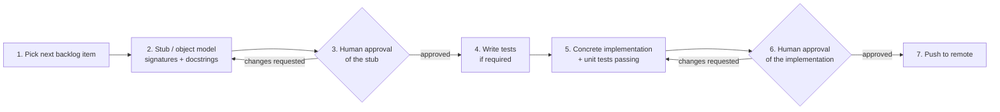

# CODE.md — Coding Workflow & Best Practices

**Purpose:** The step-by-step loop every backend story goes through, from Jira backlog item to merged code. This is process documentation, not a prompt log (see [CLAUDE.md](CLAUDE.md)) and not epic-level planning (see [EPIC.md](EPIC.md)) — it's the day-to-day discipline that applies to every story in every sprint.

**Depends on:** [EPIC.md](EPIC.md) (epics/stories this workflow executes) and the `VHIRE` Jira project (backlog/sprint source of truth).

---

## The story lifecycle

Every backlog item goes through these seven steps, in order. Steps 3 and 6 are **hard stops** — work does not proceed past them without an explicit human go-ahead in the conversation. Skipping a stop because the change "looked small" defeats the point of having it.



### 1. Pick the next backlog item

Pull the next story from the current sprint in the `VHIRE` Jira project (not the full backlog — work sprint-by-sprint, in the order the sprint was planned, unless the user redirects). State which story (key + summary) is being started before touching any files, so there's no ambiguity about scope. If a story's Jira description has drifted from [EPIC.md](EPIC.md)'s corresponding epic section, treat EPIC.md as the more detailed spec and flag the mismatch rather than silently picking one.

### 2. Stub / object model

Produce the shape of the change with no real logic behind it: function and class signatures, type hints, and a docstring per public symbol describing its **contract** — parameters, return type, exceptions it can raise, and which invariant(s) from [docs/04-invariants.md](docs/04-invariants.md) it's responsible for (if any). Stub bodies are `raise NotImplementedError("VHIRE-N")` (or `...` for a Protocol/abstract signature) — no partial logic, no "just a quick prototype" shortcut.

This step exists so the human can review *the shape of the API* before any implementation cost is sunk into it. A docstring here is doing the job real code would normally do implicitly — this is the one place in this workflow where a fuller docstring than the house style (see below) is appropriate, because there's no body yet for a reader to infer intent from.

### 3. Human approval (stub) — hard stop

Present the stub and stop. Do not write tests or implementation until the human responds. If changes are requested, revise the stub and return to this step — do not treat a single round of feedback as implicit approval to proceed past it.

### 4. Write tests, if required

Not every story needs new tests written at this step — a pure scaffolding change (e.g., a settings loader with no branching logic) may only need a smoke test, if that. Business logic, invariant enforcement (I1–I11), and anything with a failure mode does need tests written against the approved stub's contract *before* the implementation exists, so the tests describe the contract rather than the implementation. Place tests under `tests/`, mirroring the `app/` package structure (`tests/models/test_resume.py` for `app/models/resume.py`, etc.).

### 5. Concrete implementation

Implement the stub for real. Run the full local check before moving on:

```
.venv\Scripts\python.exe -m pytest
.venv\Scripts\ruff.exe check app tests
```

(or the Bash-tool equivalents: `.venv/Scripts/python.exe -m pytest`, `.venv/Scripts/ruff.exe check app tests`). All tests green, `ruff` clean — both are non-negotiable before step 6, not "close enough."

Once real logic exists, switch to this project's default comment style (see [CLAUDE.md](CLAUDE.md)'s house rules if unclear): no comments explaining *what* the code does — the stub's docstring plus well-named identifiers already cover that — only a comment where the *why* is genuinely non-obvious (a workaround, a hidden constraint, a subtlety the invariants doc calls out). Docstrings written in step 2 should be trimmed if they've become redundant with the now-visible implementation, not left bloated.

### 6. Human approval (implementation) — hard stop

Present the diff (or a summary of it) and stop again. This is a second, independent gate — approval of the stub in step 3 is not a standing approval for whatever gets implemented against it. If changes are requested, fix and return to step 5's check-and-review loop.

### 7. Push to remote

Commit with the Jira story key in the message (e.g., `VHIRE-2: add DB session/engine setup`) so the change is traceable back to its story, then push. One story is one commit (or a small tightly-related set) — don't batch multiple unrelated stories into a single commit because they happened to land in the same sitting.

---

## Definition of done, per story

A story isn't done at step 7 just because it pushed — it's done when all of the following hold:

- [ ] Matches the corresponding epic's deliverable and "Definition of done" language in [EPIC.md](EPIC.md) — not a superset (no unrequested extra scope) and not a subset (no silently dropped requirement).
- [ ] `pytest` green, `ruff check` clean.
- [ ] Every public function/class has a docstring stating its contract; invariant-enforcing code references the invariant ID (I1–I11) it implements, matching [docs/04-invariants.md](docs/04-invariants.md)'s numbering so it's greppable.
- [ ] No `NotImplementedError` stubs left behind for anything this story claimed to finish.
- [ ] Both human approval gates (steps 3 and 6) were actually granted in-conversation, not assumed.

## When to touch CHANGELOG.md vs. when not to

[CHANGELOG.md](CHANGELOG.md) records notable, architecture-level or user-facing changes (the kind this project has used it for so far: stack pivots, the pgvector→Qdrant switch) — not a per-story entry. Most individual stories from the sprint backlog will not need a CHANGELOG line. If a story turns out to change something CHANGELOG-worthy (a schema change, a new external dependency, a reversed prior decision), add an entry under `[Unreleased]` at that point — don't force one just because a commit happened.

## Branching

Work happens directly on `main` with one commit per story, matching how this repo has operated so far — no feature-branch-per-story process unless the team decides review load requires one later. If that changes, this section is the place to update.

## Environment reminders specific to this repo

- Always run tools via the project's `.venv` (`.venv\Scripts\python.exe -m pip install ...`, never a bare `pip install`) — see [CLAUDE.md](CLAUDE.md)'s scaffolding entry for why.
- Windows/PowerShell is primary; the Bash tool is also available (Git Bash/POSIX syntax) — pick whichever matches the command being run, don't mix syntaxes in one invocation.
- `.env` holds live credentials (Jira token, and eventually DB/Qdrant/AI-provider keys) and is git-ignored — never commit it, never paste its contents into a commit message or PR description.

## Open Questions

- Should Jira transitions (To Do → In Progress → Done) be driven automatically at each workflow step, or updated manually by whoever's running the session? No Jira-GitHub integration is configured yet, so commits don't auto-transition issues — decide whether that's worth setting up once sprint velocity makes manual transitions annoying.
- At what point (if any) does this project want a PR-based review step instead of direct-to-main commits — the two in-conversation approval gates currently serve the review function informally; revisit if the team grows beyond a single primary contributor.
