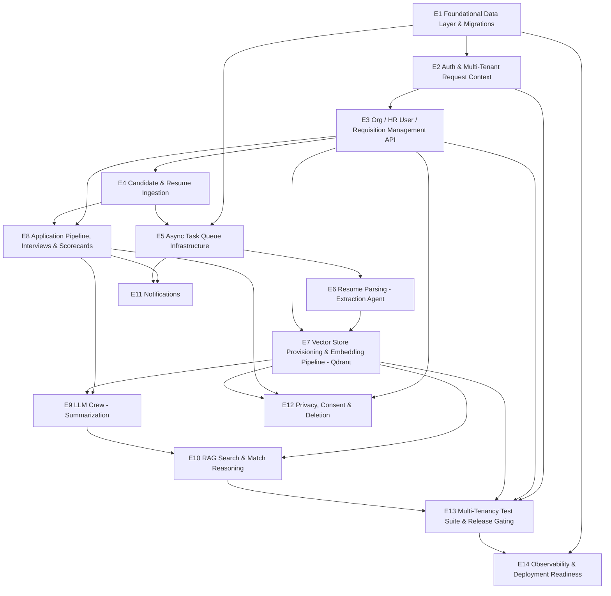

# Sift Backend — v1 Epics

**Purpose:** Break the backend work required for the v1 release (per [docs/09-roadmap.md](docs/09-roadmap.md)) into epics, sequenced by dependency, each traceable back to the ontology/invariants/architecture/stack docs it implements.

**Baseline (as of 2026-07-15):** The repo is scaffold-only. `app/{core,db,models,schemas,api/routes,services,workers,crew}` exist as empty packages (one `__init__.py` each); `app/main.py` has a real FastAPI instance with a `/health` route and nothing else. No models, no migrations, no endpoints, no workers, no crew agents. Every epic below starts from that empty state.

**Scope:** Backend only (FastAPI API + Celery workers + CrewAI crew + DB schema). Frontend, calendar integration, ATS export, and everything on the [Scope Creep Watchlist](docs/01-problem-space-and-scope.md) are excluded, matching the v1 "does NOT ship" row in [09-roadmap.md](docs/09-roadmap.md).

> **Revision note (2026-07-15):** the vector store moved from pgvector-inside-Postgres to a dedicated Qdrant instance (one collection per Organization). This changes E1 (no longer owns vector schema), E3 (now provisions the Qdrant collection at org-creation time), E7 (now targets Qdrant instead of a Postgres table), E10 (queries Qdrant instead of Postgres ANN), E12 (deletion now spans two systems), E13 (the I2/I11 test suite now proves Qdrant collection isolation, not RLS-on-a-vector-table), and E14 (Qdrant added to readiness checks). See [docs/06-architecture.md](docs/06-architecture.md) for the full reasoning and [CHANGELOG.md](CHANGELOG.md) for when this changed. This mirrors the corresponding rewrite of the Jira epic/stories in the `VHIRE` project.

---

## Epic dependency graph

## Sequencing vs. roadmap

| Epics | Maps to [09-roadmap.md](docs/09-roadmap.md) phase | Notes |
|---|---|---|
| E1, E2 | v1a (Data model + FastAPI core) | Nothing else can start until these land. E1 is now Postgres-only. |
| E3, E4, E5 | v1a / v1b boundary | E3 now also provisions each Organization's Qdrant collection — this is a new dependency E7 has on E3 that didn't exist when the vector index lived inside Postgres. |
| E6 | v1b (Ingestion + Extraction Agent parsing) | |
| E7 | v1e (Qdrant collection provisioning + embedding pipeline) | Depends on both E3 (collection must exist) and E6 (parsed text to embed) — previously depended only on E6. |
| E8 | v1c (Pipeline + scorecards — backend portion only) | Can proceed in parallel with E6/E7; no data dependency between them. |
| E9, E10 | v1f / v1g (LLM crew, RAG search) | E10 now queries Qdrant, not a Postgres ANN index. |
| E11 | Unchanged from prior design, threaded through v1c/v1b | |
| E12 | v1 ships list ("consent + deletion flow covering embeddings") | Now a two-system deletion (Postgres + Qdrant) — see the new cross-cutting risk below. |
| E13 | v1d (Multi-tenancy hardening + I2/I11 test suites) | The vector-isolation half of this suite now proves Qdrant collection-per-organization isolation, not RLS on a shared table — a materially different test design, not just a relabeling. |
| E14 | Cuts across v1a→v1g | Qdrant connectivity added to readiness checks. |

---

## E1 — Foundational Data Layer & Migrations

**Goal:** Stand up the real relational schema from [docs/05-data-model.md](docs/05-data-model.md) as SQLAlchemy models with Alembic migrations. **This epic no longer owns any vector/embedding schema** — that moved to E7 and targets Qdrant, a separate system with its own provisioning path, not an Alembic migration.

**Key deliverables:**
- `app/db/base.py` — async engine/session setup, `DATABASE_URL` from settings.
- `app/models/` — one SQLAlchemy model per Postgres table: `organizations`, `hr_users`, `job_requisitions`, `candidates`, `resumes` (including the new `embedding_status`/`embedding_error` columns), `applications`, `interviews`, `scorecards`, `analysis_outputs`, `audit_log`, with native Postgres enums and the composite/partial unique constraints (e.g., `applications` unique-while-active).
- Alembic migration(s): create all tables, the cross-table CHECK trigger enforcing I3, and the "no UPDATE on submitted scorecards" DB-role revocation for I4. **No `CREATE EXTENSION vector`, no HNSW index, no `resume_chunks` table** — all removed from this epic's scope in the 2026-07-15 revision.
- `app/core/config.py` — Pydantic settings loading everything already listed in `.env.example`, including the new `QDRANT_URL`/`QDRANT_API_KEY`.

**Depends on:** Nothing (first epic).

**Docs/invariants:** [03-ontology.md](docs/03-ontology.md), [05-data-model.md](docs/05-data-model.md), I1–I10 in [04-invariants.md](docs/04-invariants.md) (I11 is now primarily E7/E13's concern, not this epic's).

**Definition of done:** `alembic upgrade head` runs clean against a local Postgres (no `pgvector` extension required); every Postgres table/constraint in 05-data-model.md exists; RLS is *on* but not yet exercised by app code (that's E2/E13).

---

## E2 — Auth & Multi-Tenant Request Context

**Goal:** Every authenticated request resolves to exactly one `organization_id`, sourced only from a verified session/token — never a client-supplied parameter — and that org_id is injected as (a) the DB session variable RLS depends on, and (b) the Qdrant collection name resolved for any vector operation.

**Key deliverables:**
- JWT validation against the managed auth provider's JWKS endpoint (`AUTH_JWKS_URL`/`AUTH_JWT_ISSUER`/`AUTH_JWT_AUDIENCE`), producing an `HRUser` + `organization_id` request context.
- FastAPI dependency that opens a DB transaction and `SET LOCAL app.current_org_id = :org_id` before any query runs, so RLS is live for every request.
- A second resolution step off the same request context: `organization_id` → Qdrant collection name (`resumechunks_{organization_id}`) — this is the vector-store equivalent of the RLS session variable, and must be derived the same way (server-side, from the authenticated session, never from a client-supplied field).
- Candidate-side auth: magic-link / time-limited email token issuance and verification (no password), per A9.
- Role enforcement scaffolding (`hr_generalist`, `recruiter`, `hiring_manager`) for later per-route authorization.

**Depends on:** E1 (models/session plumbing must exist to set org context against).

**Docs/invariants:** I2, I3, I11 (collection-resolution half), [06-architecture.md](docs/06-architecture.md) Multi-tenancy section, [07-technical-stack.md](docs/07-technical-stack.md) auth rows.

**Definition of done:** No route can read or write data without a resolved org context; a request with a forged/omitted org claim is rejected before touching either Postgres or Qdrant; this is the dependency every other epic's endpoints/workers build on for org scoping.

---

## E3 — Organization / HR User / Requisition Management API

**Goal:** CRUD surface for the entities HR teams manage directly: organizations (admin-only), HR user invitation/lifecycle, job requisitions. **New in this revision:** Organization creation now also provisions that org's dedicated Qdrant collection, and deactivation tears it down — this lifecycle coupling didn't exist when the vector index lived inside the shared Postgres instance.

**Key deliverables:**
- `POST/GET /organizations` (bootstrap-only in v1, likely admin-tooling not self-serve signup).
- **Qdrant collection provisioning on Organization creation:** create `resumechunks_{organization_id}` (cosine distance, vector size 1024) in the same request-handling flow as the Postgres row insert — synchronous, per [06-architecture.md](docs/06-architecture.md)'s sync/async boundary table. Needs an explicit compensating action if Postgres commits but Qdrant provisioning fails (or the reverse) — resolve the open question in [06-architecture.md](docs/06-architecture.md) before building this, don't improvise it mid-implementation.
- **Qdrant collection teardown on Organization deactivation:** delete or archive the org's collection — exact behavior (immediate delete vs. retained-but-inaccessible) should follow whatever retention decision [08-privacy-and-compliance.md](docs/08-privacy-and-compliance.md) settles on for deactivated orgs.
- HR user invite → active → deactivated lifecycle endpoints.
- Job requisition CRUD, `status` transitions (`draft → open → on_hold/filled/cancelled`), `scorecard_template` validation.
- Pydantic request/response schemas in `app/schemas/`.

**Depends on:** E2.

**Docs/invariants:** [03-ontology.md](docs/03-ontology.md) (HRUser, JobRequisition lifecycle), A2/A3/A11 in [02-assumptions.md](docs/02-assumptions.md), I2/I11 (Qdrant collection lifecycle), [05-data-model.md](docs/05-data-model.md) open question on Organization/collection lifecycle coupling.

**Definition of done:** An HR user can be invited, log in, and create/manage a requisition end-to-end through the API, fully org-scoped; creating an Organization leaves it with a working, empty Qdrant collection ready for E7 to write into.

---

## E4 — Candidate & Resume Ingestion

**Goal:** The synchronous half of the submission flow in [06-architecture.md](docs/06-architecture.md)'s sequence diagram: accept a resume file, store it, create/reuse the Candidate, create the Resume and Application rows, and enqueue parsing.

**Key deliverables:**
- `Ingestion Service` (`app/services/ingestion.py`) run inline on the request path per the architecture doc (not a separate deploy).
- `POST` resume-submission endpoint: candidate email/name intake, dedup-by-email per A8, file upload to S3 with `{org_id}/{resume_id}/{filename}` namespaced keys, signed-URL generation for later retrieval.
- Row creation: `Candidate` (create-or-reuse), `Resume` (`status=uploaded`, `embedding_status=not_embedded`), `Application` (`status=submitted`) in one transaction, respecting the partial-unique constraint (one active Application per Candidate+Requisition).
- Enqueue `parse_resume` job (stubbed until E5 exists, wired for real once it does).
- Web + email-in intake channels per the v1 ships list.

**Depends on:** E3 (needs Requisition to attach the Application to), E2.

**Docs/invariants:** I1, I3, A8, [06-architecture.md](docs/06-architecture.md) submission sequence, [08-privacy-and-compliance.md](docs/08-privacy-and-compliance.md) consent capture at intake.

**Definition of done:** Submitting a resume returns `202 Accepted` with Candidate/Resume/Application rows correctly linked and org-scoped; the file is retrievable only via a scoped signed URL; a job is enqueued (even if no worker consumes it yet).

---

## E5 — Async Task Queue Infrastructure

**Goal:** The Celery + Redis backbone every downstream worker epic (E6, E7, E9, E10, E11) builds on, including how org context travels with a job.

**Key deliverables:**
- `app/workers/celery_app.py` — Celery app config against `REDIS_URL`, task routing/queues per worker type (parsing, embedding, crew, notification) matching the "separate Fargate task definitions per worker type" decision in [07-technical-stack.md](docs/07-technical-stack.md).
- A shared task base class that requires an explicit `organization_id` in every job payload and, before the task body runs, both sets `app.current_org_id` for Postgres and resolves the org's Qdrant collection name for any task that needs vector access — the async-path equivalent of E2's request-context dependency for *both* storage systems now, not just one.
- Retry/backoff policy conventions for LLM-call-bound tasks (crew-orchestrated task treated as one retryable unit for v1).
- Local dev entrypoint (`celery -A app.workers.celery_app worker`) documented in README/CLAUDE.md equivalent.

**Depends on:** E1, E4 (first real producer of jobs).

**Docs/invariants:** [06-architecture.md](docs/06-architecture.md) sync/async boundary table, I2/I11 (org context must not leak or get dropped between enqueue and execution, for either Postgres or Qdrant).

**Definition of done:** A test task round-trips through Redis, executes with the correct org context set for both storage systems, and a task raising an exception is retried per policy rather than silently dropped.

---

## E6 — Resume Parsing (Extraction Agent)

**Goal:** The Parsing Worker: fetch the file, run the Extraction Agent (Claude Haiku 4.5), write `parsed_data`, enqueue embedding. **Unchanged by the Qdrant pivot** — this epic never touched vector storage.

**Key deliverables:**
- `app/crew/agents/extraction.py` — CrewAI agent bound to Haiku 4.5 per the fixed model assignment in [07-technical-stack.md](docs/07-technical-stack.md).
- `parse_resume` Celery task: fetch from S3 → text extraction → structured field extraction (work history, education, skills) → write `resumes.parsed_data`, `status=parsed` → enqueue `embed_resume`.
- Failure path: any extraction exception sets `status=parse_failed` with `parse_error` populated — never left stuck in `parsing` (I6).
- `resumes.status` is worker-written only; confirm no API route exposes direct client writes to it.

**Depends on:** E5.

**Docs/invariants:** I6, [06-architecture.md](docs/06-architecture.md) Parsing Worker row, [07-technical-stack.md](docs/07-technical-stack.md) model assignment.

**Definition of done:** A submitted resume reaches `status=parsed` with populated `parsed_data` on the happy path, and reaches `status=parse_failed` (not stuck) on a forced failure.

---

## E7 — Vector Store Provisioning & Embedding Pipeline (Qdrant)

**Goal:** Chunk parsed resume text, embed each chunk, and upsert into the candidate's organization's dedicated Qdrant collection — this epic replaces the prior "Embedding Pipeline (pgvector)" epic entirely; the storage target changed, not just an implementation detail underneath the same schema.

**Key deliverables:**
- `app/services/vector_store.py` — a thin Qdrant client wrapper: collection provisioning helper (used by E3 at org-creation time), point upsert/delete-by-resume, and the similarity-search call E10 will use. Centralizing this is what lets the embedding-dimension/model-version open question in [07-technical-stack.md](docs/07-technical-stack.md) stay a one-place change later.
- `app/services/chunking.py` — chunk size/overlap strategy for resume text (an implementation-detail tuning parameter per [05-data-model.md](docs/05-data-model.md); pick a starting value, e.g. ~500 tokens / 50 overlap, as a service-config constant).
- `embed_resume` Celery task: chunk → call Voyage AI (`voyage-3`) per chunk → upsert points into `resumechunks_{organization_id}` (deterministic point ID from `(resume_id, chunk_index)`, so re-embedding is a plain upsert, not a separate delete-then-insert) → write `resumes.embedding_status=embedded` (or `embed_failed` with `embedding_error` populated) back to Postgres.
- Every point payload includes a redundant `organization_id` field (belt-and-suspenders filter, per I2/I11), even though the collection itself is already org-scoped.

**Depends on:** E6 (parsed text to embed), E3 (the org's Qdrant collection must already be provisioned).

**Docs/invariants:** I11, the "Vector store (Qdrant)" section of [05-data-model.md](docs/05-data-model.md), Embedding Worker row in [06-architecture.md](docs/06-architecture.md).

**Definition of done:** A parsed resume produces points in its organization's Qdrant collection with correct payload fields and 1024-dim embeddings; re-running embedding on the same resume replaces rather than duplicates points (verify via the deterministic point-ID upsert); `resumes.embedding_status` reflects the outcome; a same-org smoke query against the collection returns the expected chunks (full cross-tenant proof is E13's job).

---

## E8 — Application Pipeline, Interviews & Scorecards

**Goal:** The backend half of "pipeline + scorecards" — status transitions, interview scheduling metadata, and scorecard submission/amendment with full audit trail. **Unaffected by the Qdrant pivot** — this epic has no vector-store dependency and can run in parallel with E6/E7.

**Key deliverables:**
- Application status-transition endpoint backed by an explicit state machine matching the diagram in [04-invariants.md](docs/04-invariants.md) exactly — reject any (from, to) pair not on that diagram (I5).
- Interview CRUD (`scheduled/completed/cancelled/no_show`), always referencing exactly one Application (I7).
- Scorecard submission endpoint: create as `draft`, transition to `submitted` (locks further direct writes), enforced 1:1 with Interview via the DB unique constraint (I8).
- Scorecard amendment endpoint (distinct from update): writes the change plus an `audit_log` row in the same transaction, preserving the original (I4).
- `audit_log` write path — append-only, no update/delete exposed anywhere in the API.

**Depends on:** E3, E4.

**Docs/invariants:** I4, I5, I7, I8, state diagram in [04-invariants.md](docs/04-invariants.md), `scorecards`/`interviews`/`audit_log` tables in [05-data-model.md](docs/05-data-model.md).

**Definition of done:** State-machine unit tests enumerate every (from, to) pair from the diagram and only the valid ones succeed; submitting then amending a scorecard leaves both the original and an audit_log entry queryable; a direct update attempt on a submitted scorecard is rejected at the DB layer, not just the API layer.

---

## E9 — LLM Crew: Summarization

**Goal:** On-demand candidate/Application summary generation — the Summarizer Agent half of the LLM crew, gated so it only ever sees submitted scorecards (I10). **Data-fetch step is unaffected by the Qdrant pivot** (it reads Postgres scorecards, not vectors), but this epic now formally depends on E7 since it shares a crew definition with E10.

**Key deliverables:**
- `app/crew/agents/summarizer.py` — CrewAI agent bound to Sonnet 5.
- `app/crew/crew.py` — the shared crew definition referenced by both this epic and E10.
- Data-fetch step that queries `scorecards WHERE status = 'submitted'` exclusively before building agent context — the concrete I10 enforcement point.
- `generate_summary` Celery task: on-demand trigger → write/upsert `analysis_outputs` (`summary`, `source_scorecard_ids`, `crew_run` model-provenance metadata, `generated_at`).
- Staleness handling: flip `analysis_outputs.stale = true` when a new Scorecard is submitted for that Application after `generated_at`; lazy regeneration triggered on next view request.
- `GET` endpoint to fetch (and lazily trigger regeneration of) an Application's current summary.

**Depends on:** E8 (needs submitted scorecards to summarize), E7 (shared crew scaffolding).

**Docs/invariants:** I10, `analysis_outputs` table, Summarizer row in [06-architecture.md](docs/06-architecture.md), model assignment in [07-technical-stack.md](docs/07-technical-stack.md).

**Definition of done:** Integration test: create a draft scorecard alongside submitted ones for the same Application, trigger analysis, assert the draft's content appears nowhere in the generated output or the crew's retrieved context; regenerating overwrites in place (no history table).

---

## E10 — RAG Search & Match Reasoning

**Goal:** HR-initiated, query-scoped candidate search: embed the query, run a similarity search against the requesting org's Qdrant collection only, then have the Reasoning Agent produce a per-candidate rationale — never a blended ranking score.

**Key deliverables:**
- `app/crew/agents/reasoning.py` — CrewAI agent bound to Opus 4.8.
- Search endpoint: accepts free-text query + optional `requisition_id`, enqueues a search job with `org_id` in the payload (never inferred from content).
- `search` Celery task: embed query (Voyage) → similarity search against `resumechunks_{org_id}` **only** (collection resolved server-side from the job's org_id, per E2/E5's context-propagation design) with the redundant `organization_id` payload filter also applied → Reasoning Agent call over the retrieved chunks only → write/refresh `analysis_outputs.match_rationale` for matched Applications.
- Result delivery: short-polling (`GET /search/{job_id}`) or an equivalent status-check endpoint, per the sync/async boundary table — full streaming is an explicit open question in [06-architecture.md](docs/06-architecture.md) and can be deferred past v1.
- Response shape: ranked-by-relevance list of candidates with rationale text and a link back to the full record — no single blended score field.

**Depends on:** E7, E9 (shares the crew definition and `analysis_outputs` write path).

**Docs/invariants:** I11 (the highest-risk new surface — now enforced by Qdrant collection-per-organization, not RLS, per [04-invariants.md](docs/04-invariants.md)'s 2026-07-15 revision), RAG search sequence diagram in [06-architecture.md](docs/06-architecture.md).

**Definition of done:** Seed two organizations' Qdrant collections with semantically near-identical resume content; search as Org A; assert zero Org B points are ever retrieved or reasoned over, **and** assert that a request carrying a forged/spoofed `org_id` cannot cause the search job to resolve to a different organization's collection; response contains rationale text, not a bare ranking score.

---

## E11 — Notifications

**Goal:** Transactional email on pipeline state changes. **Unaffected by the Qdrant pivot.**

**Key deliverables:**
- `notify` Celery task consuming events from Application status transitions and Scorecard submission.
- Integration with the transactional email provider (Postmark/SES per [07-technical-stack.md](docs/07-technical-stack.md)) via `EMAIL_PROVIDER_API_KEY`.
- Template set for the minimum v1 notification set (submission confirmation, status change, interview scheduled).

**Depends on:** E5, E8 (the events it reacts to).

**Docs/invariants:** Notification Worker row in [06-architecture.md](docs/06-architecture.md), async classification in the sync/async boundary table.

**Definition of done:** An Application status transition or scorecard submission reliably enqueues and sends the corresponding email in a dev/sandbox provider setup, without blocking the triggering API request.

---

## E12 — Privacy, Consent & Deletion

**Goal:** Implement I9's right-to-be-forgotten routine end-to-end. **This epic changed materially in this revision:** deletion now spans two systems (Postgres + Qdrant) instead of one transactional database, which is a new consistency risk to design for, not just an implementation detail to swap.

**Key deliverables:**
- Consent capture at resume submission (candidate-facing disclosure of AI processing, per [08-privacy-and-compliance.md](docs/08-privacy-and-compliance.md)).
- Deletion endpoint/routine: anonymize `candidates.full_name/email/phone` in place, set `pii_deleted_at`, anonymize free-text scorecard fields referencing the candidate by name — all without deleting rows (preserves I9's aggregate-analytics guarantee) — this half stays a single Postgres transaction.
- **Cross-system delete step:** after (or as part of) the Postgres transaction, delete all Qdrant points for the candidate's resumes from their organization's collection, plus the resume file in object storage. **Must include an explicit compensating-action design** (retry queue with alerting, or a reconciliation job diffing "deleted in Postgres" against "still present in Qdrant") — see the new risk called out in [08-privacy-and-compliance.md](docs/08-privacy-and-compliance.md); do not ship this as a best-effort fire-and-forget call.
- Retention-window enforcement per the retention table in [08-privacy-and-compliance.md](docs/08-privacy-and-compliance.md), if any automatic (non-request-driven) retention expiry is in v1 scope — confirm with the product owner before building.

**Depends on:** E3 (candidate ownership), E8, E7 (points to purge).

**Docs/invariants:** I9, [08-privacy-and-compliance.md](docs/08-privacy-and-compliance.md) deletion flow diagram and its new two-system consistency risk section.

**Definition of done:** Integration test: trigger deletion, assert PII fields are anonymized in Postgres and all corresponding points are gone from the org's Qdrant collection, assert aggregate requisition funnel counts are unchanged; a second test forcing the Qdrant delete call to fail confirms the compensating-action path (retry/alert/reconciliation) actually fires rather than silently leaving orphaned points.

---

## E13 — Multi-Tenancy Test Suite & Release Gating

**Goal:** The automated cross-tenant test suite that [04-invariants.md](docs/04-invariants.md) and [09-roadmap.md](docs/09-roadmap.md) both call a release blocker — covering I2 (Postgres relational data) and I11 (Qdrant vector search). **The I11 half of this suite is a materially different test design in this revision:** it now proves collection-per-organization structural isolation plus collection-resolution correctness, not "does the RLS policy filter rows correctly."

**Key deliverables:**
- Test harness: seed two organizations with overlapping/near-identical data, including semantically similar resumes embedded into each organization's own Qdrant collection.
- I2 suite: authenticated as Org A, attempt to read every Org B entity by ID across every resource type, assert 404/denied on all of them.
- I11 suite: (a) run a vector similarity search as Org A seeded to be a near-perfect semantic match for Org B content, assert zero Org B points are returned regardless of similarity score; (b) attempt to construct a request/job with a spoofed or manipulated `org_id` and assert it cannot cause collection resolution to point at another organization's collection — this second case is new and specific to the collection-per-org design, distinct from the old "does the query filter correctly" test shape.
- Wire this suite into CI as a required, non-skippable check gating merges to main / release builds.

**Depends on:** E2, E3 (collection provisioning must exist to seed test collections), E7, E10.

**Docs/invariants:** I2, I11, the v1→v2 exit criteria in [09-roadmap.md](docs/09-roadmap.md).

**Definition of done:** Suite runs in CI, fails the build on any cross-tenant leak in either Postgres or Qdrant, and is documented as a required check.

---

## E14 — Observability & Deployment Readiness

**Goal:** The minimum operational scaffolding needed to run this in a pilot: structured logging, health checks per worker type and per storage dependency, error tracking, and deployable configs.

**Key deliverables:**
- Structured logging (org_id, request_id/job_id correlation) across API and all worker types.
- `/health` (already stubbed) extended with a real readiness check — **now covering both Postgres and Qdrant connectivity**, not just Postgres; equivalent liveness signal for each Celery worker type.
- Error tracking integration (e.g., Sentry) for both API and worker processes.
- The monitoring alert for resumes stuck in `parsing` past a timeout threshold (I6), plus a new alert for resumes stuck in `embedding_status=embedding` past a timeout — the Qdrant-side analog that didn't exist as a distinct concern when embedding was a synchronous-feeling part of the same Postgres write path.
- Deployment configs: separate task definitions for API, parsing worker, embedding worker, crew worker, notification worker, plus Qdrant Cloud connection/credential management as a distinct operational concern from RDS/ElastiCache.

**Depends on:** E1 (baseline), E13 (nothing ships to a pilot without the isolation suite green).

**Docs/invariants:** I6 operational enforcement note, Hosting row in [07-technical-stack.md](docs/07-technical-stack.md).

**Definition of done:** Every process type can be started independently with its own health signal; readiness check fails loudly if Qdrant is unreachable, not just if Postgres is; a resume stuck in `parsing` or stuck in `embedding` triggers an alert; API and worker errors surface in a trackable place, not just stdout.

---

## Cross-cutting risks carried over from the docs

| Risk | Source | Implication for epic sequencing |
|---|---|---|
| RAG search (E7/E9/E10) is a sequential dependency before pilot onboarding in the current roadmap timeline. | [09-roadmap.md](docs/09-roadmap.md) open questions | If the team wants to de-risk pilot timing, E8 (pipeline/scorecards) could ship as a leaner backend-only v1 slice while E6/E7/E9/E10 follow as a fast-follow. |
| No fallback/secondary LLM provider. | [07-technical-stack.md](docs/07-technical-stack.md) | E9/E10 should at minimum have circuit-breaking/graceful-degradation behavior even without a second provider. |
| Embedding vector dimension/model version has no documented migration plan — **now more consequential**, since a swap requires provisioning new Qdrant collections (vector size is fixed per collection) across every organization, not a single-table migration. | [05-data-model.md](docs/05-data-model.md), [07-technical-stack.md](docs/07-technical-stack.md) | E7 should isolate the embedding-model reference and collection-naming scheme behind `app/services/vector_store.py` so a future migration isn't a full rewrite. |
| `audit_log` has no partitioning/archival strategy. | [05-data-model.md](docs/05-data-model.md) | Explicitly deferred to v2; E1 should just avoid designs that would block adding partitioning later. |
| **New:** deletion (I9) now spans two systems with no shared transaction — a partial failure leaves either orphaned searchable PII in Qdrant or an unreconciled anonymization in Postgres. | [08-privacy-and-compliance.md](docs/08-privacy-and-compliance.md) | E12 must ship a compensating-action mechanism (retry/alert or reconciliation job), not a bare best-effort call — treat this as part of E12's definition of done, not a follow-up. |
| **New:** Qdrant collection-per-organization is a deliberate reversal of the prior "avoid a second tenant-isolation surface" decision, accepted for performance/scaling reasons. | [06-architecture.md](docs/06-architecture.md) | E13's test suite is the concrete proof this tradeoff is safe in practice — do not treat it as a lower-priority test class than the original Postgres RLS suite just because it's newer. |
| **New:** Organization creation/deactivation now has a distributed-provisioning step (Postgres row + Qdrant collection) with its own partial-failure mode. | [06-architecture.md](docs/06-architecture.md) open questions | E3 needs an explicit answer to "what happens if Qdrant collection provisioning fails after the Postgres org row commits" before this is built, not improvised during implementation. |
