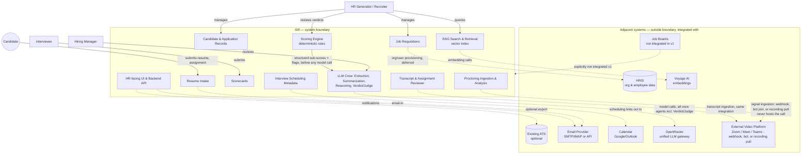

# 01 — Problem Space and Scope

**Purpose:** Define the problem precisely (not as a solution in disguise) and draw a hard boundary around what v1 will and will not do.

**Depends on:** [00-ideation.md](00-ideation.md) (problem framing, non-goals, users).
**Feeds into:** [02-assumptions.md](02-assumptions.md) (assumptions are only meaningful once scope is fixed) and [09-roadmap.md](09-roadmap.md) (phases are scope commitments over time).

---

## Precise problem statement

> HR teams cannot reliably answer "what is the current, complete state of this candidate's pipeline?" at the moment a hiring decision needs to be made, because resume intake, requisition matching, and interview feedback each live in different uncoordinated systems (email, spreadsheets, chat, memory), with no shared record and no enforced structure.

Note what this statement does *not* say: it does not say "we need an AI resume screener" or "we need a Kanban board." Those are candidate solutions. The problem is the *absence of a single structured, up-to-date record* connecting candidate → requisition → interview feedback. Any v1 design must be evaluated against whether it closes that specific gap.

**Revision note (2026-07-16):** the problem now has a second half, addressed by the three scored-assessment services introduced in [00-ideation.md](00-ideation.md): even where a structured record *does* exist (a resume, a completed interview, a submitted assignment), HR teams have no consistent, explainable way to assess it — assessment quality varies by interviewer, resume screening is inconsistent across recruiters, and there's no signal at all today for interview integrity. The scope table below treats this as a direct extension of the same core problem, not a separate initiative.

## In-scope vs out-of-scope (v1)

| Area | In scope | Out of scope |
|---|---|---|
| Resume intake | Upload via web form, email-in address, structured parsing into candidate fields | Sourcing/scraping candidates from job boards or LinkedIn |
| Candidate record | Single structured record per organization with parsed resume data, contact info, application history within that org | Global candidate identity shared/deduplicated across organizations |
| Requisition management | Create/edit job requisitions, link applications to them | Full org-chart/headcount planning, budget approval workflows |
| Application pipeline | Status tracking through a defined state machine (see [04-invariants.md](04-invariants.md)) | Configurable/custom pipeline stages per organization (v1 ships one fixed pipeline) |
| Interview scheduling | Record interview metadata (who, when, which application) | Native calendar UI / free-busy negotiation (v1 links out to existing calendar tools) |
| Interview feedback | Structured scorecards (ratings + free text) per interview | — |
| Analysis output | Structured summarization of resume + aggregated scorecards for a hiring manager view, produced by a multi-model LLM crew (see [06-architecture.md](06-architecture.md)) | Autonomous candidate ranking or auto-recommendation with no human query behind it |
| Resume search & retrieval | HR-initiated semantic search over resumes within one organization via a RAG pipeline (vector search + LLM-generated match rationale against a specific query or requisition) | Background/always-on ranking of the full candidate pool; using match output to auto-advance, auto-reject, or gate a pipeline stage |
| **Resume Analyzer verdict** | Deterministic rule-based scoring of a parsed resume against a requisition's requirements, reviewed by the Verdict/Judge agent into a `pass`/`review`/`fail` narrative verdict | Verdict auto-advancing or auto-rejecting an Application — always advisory, per [00-ideation.md](00-ideation.md)'s non-goals |
| **Interview live proctoring** | Ingesting audio/video signal from an external video platform's webhook/recording/bot integration for a completed or in-progress interview; deterministic + LLM-judged detection of behavioral/biometric integrity signals (multiple faces, face not detected, voice mismatch, etc.); org-by-org enablement gated on that organization's jurisdiction clearing legal review (see [08-privacy-and-compliance.md](08-privacy-and-compliance.md)) | Sift hosting/mixing the live call itself; real-time intervention (pausing, warning, ending the interview, or blocking a candidate); enabling proctoring for an organization/jurisdiction before its legal review is signed off |
| **Interview transcript + assignment reviewer** | Ingesting an interview transcript (vendor-provided or generated) and an optional take-home assignment submission; deterministic rubric scoring + LLM-judged competency verdict | Auto-grading/code-execution sandboxing of assignment submissions; using the verdict to auto-advance or auto-reject |
| **Scoring engine** | Shared deterministic rules framework producing structured sub-scores/flags per service, consumed by the Verdict/Judge agent before any large-model call | A configurable/no-code rules builder for HR users — v1 rules are engineering-authored and versioned in code |
| Multi-org support | Multiple organizations on one platform, strictly isolated (isolation now also covers the vector index, not just relational data) | Cross-org candidate matching, talent marketplace, or referral network |
| Communication | Transactional email notifications (application received, interview scheduled, decision made) | Marketing/nurture email sequences to candidates |
| Compliance | Basic consent capture, PII deletion on request; **explicit separate consent capture for interview proctoring specifically, from both candidate and interviewer** | Full legal compliance certification (see [08-privacy-and-compliance.md](08-privacy-and-compliance.md) — flagged for legal review) |

## Scope Creep Watchlist

Each of these will be proposed during the project's life. Each is explicitly out for v1, with the condition that would justify reconsidering it.

| Tempting feature | Why it's out for v1 | What would need to be true to bring it in |
|---|---|---|
| **Autonomous candidate ranking/auto-scoring (background, no query, gates a decision)** | Turns Sift into a decision-maker instead of a record-keeper; introduces bias, liability, and explainability problems before the underlying structured data even exists to rank against. **Note:** this is distinct from the v1 RAG search/matching capability and the three verdict services, all of which are advisory-only and never auto-gate a decision — see [06-architecture.md](06-architecture.md) for where that boundary is drawn. | A full cycle of structured scorecard + resume data exists across multiple orgs, legal has reviewed disparate-impact risk, and ranking is opt-in/advisory only, never gating. |
| **Full ATS replacement (offers, e-signature, onboarding)** | Each of these is its own regulated, integration-heavy domain (e-signature has legal requirements; onboarding touches payroll/HRIS). Building them dilutes focus on the actual gap: pipeline visibility. | Sift has proven the pipeline/scorecard core with real orgs, and there's demand to consolidate rather than integrate with an existing ATS/HRIS. |
| ~~Video interview recording/analysis~~ **Graduated to in-scope 2026-07-16** | See "Interview live proctoring" in the scope table above. Retained here struck through, not deleted, as a record that this line item existed and was deliberately excluded before being deliberately reversed — the reversal does not erase the original reasoning (storage cost, multi-jurisdiction consent complexity) below, which is now handled as an explicit compliance gate rather than an exclusion. | N/A — already in scope, gated per-organization/jurisdiction on legal review. |
| **Sift-hosted live video/conferencing** | Distinct from proctoring itself (which only ingests signal from an *external* platform) — building a WebRTC call surface is a different, much larger product with its own real-time infra, quality, and reliability bar. | Organizations specifically ask Sift to host the call, not just analyze it, and the team is prepared to own real-time media infrastructure. |
| **Real-time proctoring intervention (auto-pause, auto-warn, auto-end, auto-disqualify)** | Turns an advisory signal into an autonomous action mid-interview — the same bias/liability/explainability problem the autonomous-ranking exclusion above describes, but higher-stakes because it happens live, in front of the candidate, with no time for human review. | Not planned to ever be brought in-scope without a fundamentally different product/liability posture — kept here as a standing boundary, not a "not yet." |
| **Candidate-facing proctoring dispute/appeal workflow** | Requires a candidate-facing UI surface beyond the current magic-link/notification-only interface (per A9), plus a human-review process for disputed flags — real scope, but downstream of proctoring shipping at all. | Interview proctoring is live with real organizations and disputed-flag volume is high enough to need a formal process rather than ad hoc HR handling. |
| **Assignment auto-grading / code execution sandboxing** | Running untrusted candidate-submitted code requires a sandboxed execution environment — a significant new infra surface (isolation, resource limits, security hardening) unrelated to the LLM-judged rubric scoring v1 ships. | Assignment volume for code-based roles is high enough that manual/LLM-judged review alone is a recruiter bottleneck, and the security investment is justified. |
| **Native sourcing / job board syndication** | Different problem entirely (finding candidates vs. processing ones who already applied); pulls in job-board API integrations and posting-management UI unrelated to the core gap. | Organizations using Sift consistently report sourcing as their top unmet need, not just intake/tracking. |
| **Full ATS replacement via deep 3rd-party ATS integration (bi-directional sync)** | Two-way sync with external ATS systems risks data conflicts and is a significant integration surface per-vendor; v1 needs to work standalone first. | A specific, named integration is requested by a paying org and one-way export (already in v2, see roadmap) is proven insufficient. |
| **Custom/configurable pipeline stages per organization** | Configurability multiplies the state machine's test surface and UI complexity before we know if the fixed pipeline actually fits most orgs. | Multiple pilot orgs hit concrete cases where the fixed pipeline breaks their process, not just preference. |
| **Candidate-facing self-service portal (status tracking, profile editing)** | Candidates are a secondary user in v1 (submit + receive notifications only); a full portal is a second UI surface with its own auth/session needs. | Candidate volume and repeat-application rate justify the build; validated via the notification-only flow first. |

## Scope boundary (bounded context)

`F` (LLM Crew, now four agents: Extraction, Summarization, Reasoning, and the new Verdict/Judge) and `H` (RAG Search & Retrieval) sit inside the system boundary — Sift owns the vector index and the orchestration of which model does what — but both depend on hosted providers as external adjacent systems, the same way email delivery is external. As of this revision, all crew model calls (including the new Verdict/Judge agent) route through **OpenRouter** as a single unified gateway rather than calling Anthropic directly — see [07-technical-stack.md](07-technical-stack.md). Candidate PII (resume text, chunks, transcript text, proctoring signal descriptions) leaving the boundary to reach that provider is a compliance-relevant data flow, tracked in [08-privacy-and-compliance.md](08-privacy-and-compliance.md) — the proctoring service in particular sends biometric-adjacent data off-boundary and is treated with the heaviest review requirement in that document.

`J` (Proctoring Ingestion & Analysis) and `K` (Transcript & Assignment Reviewer) are new in this revision. Both depend on an external video platform the *organization* already uses (Zoom, Google Meet, Teams, etc.) as an adjacent system — Sift never hosts the call itself, only ingests a signal (webhook events, a bot joining as a passive observer, or a post-call recording/transcript pull), consistent with the "not a video conferencing platform" non-goal in [00-ideation.md](00-ideation.md). `I` (Scoring Engine) is the shared deterministic layer every one of the three verdict services routes through before any model call reaches `F`.

The dotted lines are integration points, not data ownership — Sift does not own calendar state, email delivery, or ATS records. It owns candidate, application, requisition, interview-metadata, and scorecard data for the duration those entities are within its defined lifecycle (see [04-invariants.md](04-invariants.md)).

## Open Questions

- Should v1 support a one-way *export* to an existing ATS (CSV/API push) even though bi-directional sync is out of scope? Leaning yes for v2 — see roadmap.
- Is "one fixed pipeline" per organization sufficient, or do we need at least *stage renaming* (not reordering/adding) as a v1 concession?
- Where exactly does "interview scheduling metadata" end and "calendar integration" begin — do we store proposed time slots, or only the finalized time once set elsewhere?
- **New in this revision:** which video platform(s) does v1 actually integrate with first — Zoom, Google Meet, Teams, or a platform-agnostic approach via a third-party meeting-bot vendor that itself supports multiple platforms? This materially changes [07-technical-stack.md](07-technical-stack.md)'s integration approach and isn't yet decided.
- **New in this revision:** does interview proctoring ship for every organization by default (opt-out) or is it strictly opt-in per organization, enabled only after that org's jurisdiction clears legal review — the scope table above assumes opt-in/gated, confirm this is the intended default.
- **New in this revision:** is a face/gaze/voice detection vendor being integrated (buy), or is Sift building this analysis in-house (build) — this is undecided and has a large effect on [07-technical-stack.md](07-technical-stack.md) and the compliance subprocessor list in [08-privacy-and-compliance.md](08-privacy-and-compliance.md).
