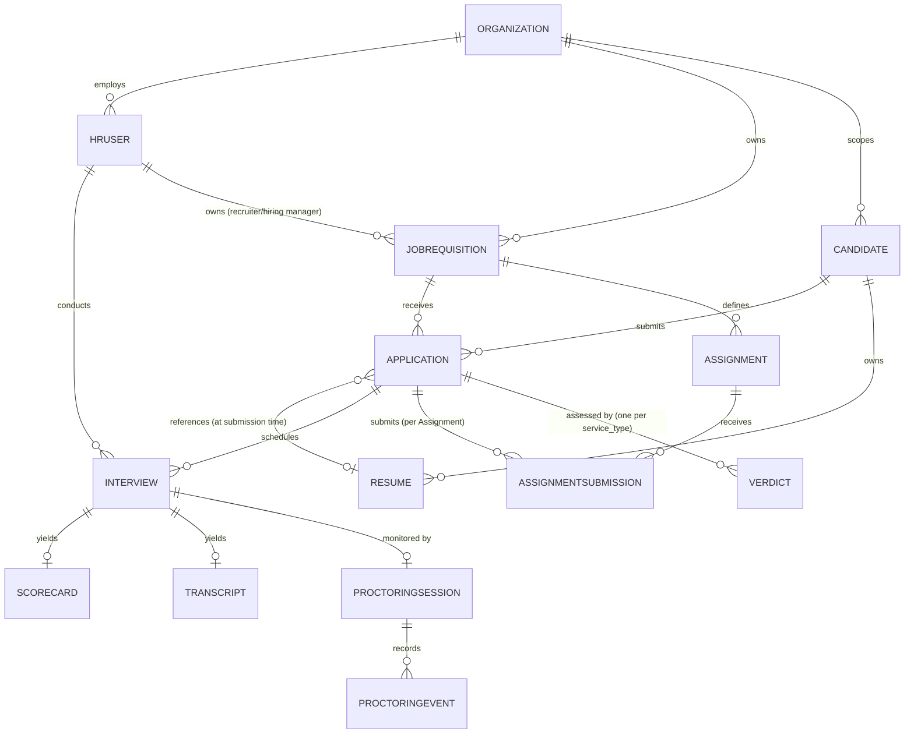

# 03 — Ontology

**Purpose:** Define the core nouns of the system — what they are, what makes two instances the same or different, and what states they move through.

**Depends on:** [02-assumptions.md](02-assumptions.md) (entity boundaries follow directly from the org/candidate/interview assumptions).
**Feeds into:** [04-invariants.md](04-invariants.md) (rules are stated in terms of these entities) and [05-data-model.md](05-data-model.md) (every entity here becomes a table).

---

## Design principle

Model only what v1 needs to operate. An entity earns a place here if the system must query, constrain, or transition it independently. If a concept can live as a field on another entity, it does not get its own primitive — see "Not a first-class entity" below.

## Core primitives

### Organization
The tenant boundary. Everything else in the system exists within exactly one Organization.
- **Identity:** system-generated ID. Two Organizations are never the same entity even if names collide (e.g., two different companies named "Acme").
- **Lifecycle:** `active` → `suspended` → `active` (billing/admin action) or `active` → `deactivated` (terminal, data retained per [08-privacy-and-compliance.md](08-privacy-and-compliance.md)).

### HRUser
A person acting on behalf of an Organization: HR generalist, recruiter, or hiring manager. (Interviewer is a role an HRUser can hold on a specific Interview, not a separate account type — see A3 in [02-assumptions.md](02-assumptions.md).)
- **Identity:** email address, unique within an Organization (per A2, one Organization per HRUser in v1).
- **Lifecycle:** `invited` → `active` → `deactivated`. Deactivated HRUsers are retained for audit-trail integrity (past scorecards/actions remain attributed) but cannot authenticate.

### JobRequisition
An open role an Organization is hiring for.
- **Identity:** system-generated ID, scoped to an Organization. Title + department is not identity — two requisitions can share a title.
- **Lifecycle:** `draft` → `open` → `on_hold` ⇄ `open` → `filled` | `cancelled` (terminal states).

### Candidate
A person who has submitted at least one Application to a specific Organization.
- **Identity:** system-generated ID, scoped to an Organization. Per A1/A8, Candidate identity is **not** shared across Organizations — the same human applying to two different Organizations on Sift produces two independent Candidate records. Within one Organization, email address is the practical dedup key.
- **Lifecycle:** `active` (has at least one live Application) → `archived` (no open Applications, retained per retention policy) → `deleted` (right-to-be-forgotten executed, see [08](08-privacy-and-compliance.md)).

### Resume
A single uploaded document representing one Candidate's work history, plus the structured data extracted from it.
- **Identity:** system-generated ID. A Resume is a distinct entity from the file bytes — re-parsing does not create a new Resume, it updates extracted fields on the same one.
- **Lifecycle:** `uploaded` → `parsing` → `parsed` | `parse_failed` (terminal-ish; can be retried, which returns it to `parsing`).

### Application
The join of a Candidate to a JobRequisition — "this person applied for this role." This is the entity the pipeline state machine operates on.
- **Identity:** system-generated ID. A given (Candidate, JobRequisition) pair should have at most one active Application — reapplication after rejection is a policy decision handled at the application layer (see [04-invariants.md](04-invariants.md)).
- **Lifecycle:** see full state diagram in [04-invariants.md](04-invariants.md) — `submitted` → `screening` → `interviewing` → `offer` → `hired`, with `rejected` and `withdrawn` reachable from most non-terminal states.

### Interview
A single interview session between one Interviewer and one Application's Candidate.
- **Identity:** system-generated ID. Per A12, a panel interview with three interviewers produces three Interview records, not one — each carries its own scheduling metadata and yields its own Scorecard.
- **Lifecycle:** `scheduled` → `completed` | `cancelled` | `no_show`.

### Interviewer
A role, not a separate account: an HRUser assigned to conduct a specific Interview. Modeled as the relationship between HRUser and Interview, not a standalone entity — see "Not first-class" below for the reasoning.

### Scorecard
The structured feedback record for one completed Interview.
- **Identity:** system-generated ID, 1:1 with the Interview it belongs to (per A12).
- **Lifecycle:** `draft` (interviewer is filling it in) → `submitted` (locked; see immutability invariant in [04](04-invariants.md)) → `amended` (a correction was made via the audit-trailed amendment process, original preserved).

### Transcript **[New 2026-07-16]**
The text record of one Interview's conversation, either provided directly by the video platform's transcription feature or generated by a speech-to-text step Sift owns (per A27).
- **Identity:** system-generated ID, 1:1 with the Interview it belongs to.
- **Lifecycle:** `pending` (interview completed, transcript not yet ingested) → `available` (text ingested and ready for review) | `unavailable` (ingestion failed, or the platform never produced one — terminal, not retried indefinitely).

### ProctoringSession **[New 2026-07-16]**
The record of interview-integrity monitoring for one Interview, tied to that Interview's external video platform meeting. Carries the consent state required before any signal ingestion begins (per A22) — consent here is a field on this entity, following the same "consent as a field, not a standalone ledger entity" precedent as the existing ConsentRecord decision below, extended to cover both parties.
- **Identity:** system-generated ID, 1:1 with the Interview it belongs to.
- **Lifecycle:** `not_configured` (proctoring not enabled for this interview) → `consent_pending` → `active` (both parties consented, signal ingestion underway) → `analyzing` (interview ended, deterministic scoring + Verdict/Judge running) → `completed` | `failed`.

### ProctoringEvent **[New 2026-07-16]**
A single detected integrity signal within a ProctoringSession (e.g., "second face detected," "candidate face not visible for 45s," "voice mismatch detected"), timestamped against the interview's own timeline.
- **Identity:** system-generated ID. No independent lifecycle — immutable once recorded, append-only within its ProctoringSession, the same "record of what happened, never edited" posture as `audit_log`.

### Assignment **[New 2026-07-16]**
A take-home exercise definition, authored once and reused across every Candidate applying to the JobRequisition it belongs to (same "define once per requisition" pattern as `scorecard_template`, but promoted to its own entity since an Assignment has independent draft/publish lifecycle and multiple Candidates' submissions reference it).
- **Identity:** system-generated ID, scoped to a JobRequisition.
- **Lifecycle:** `draft` → `published` (visible to candidates in that requisition's pipeline) → `archived`.

### AssignmentSubmission **[New 2026-07-16]**
One Candidate's response to an Assignment, for a specific Application.
- **Identity:** system-generated ID. At most one active submission per (Application, Assignment) pair in v1 — resubmission behavior is an open question, not yet designed (see below).
- **Lifecycle:** `submitted` → `reviewed` (a Verdict has been generated against it).

### Verdict **[New 2026-07-16]**
The scored, explainable assessment output shared by all three services described in [00-ideation.md](00-ideation.md): a deterministic sub-score breakdown from the Scoring Engine, plus a narrative from the Verdict/Judge agent, resolving to one of `pass` / `review` / `fail`.
- **Identity:** system-generated ID. At most one *current* Verdict per (Application, service_type) — up to three Verdicts can exist for a given Application, one per service (`resume_analysis`, `interview_proctoring`, `transcript_assignment_review`), each independently regenerable. This mirrors AnalysisOutput's "regenerated in place, no history table" pattern, applied per service_type instead of a single row per Application.
- **Lifecycle:** `generated` → regenerated in place when its underlying input changes (e.g., a new Scorecard submitted after a `transcript_assignment_review` Verdict was generated) — a `stale` flag is set rather than immediately regenerating, matching AnalysisOutput's lazy-regeneration pattern.

## Entity-relationship diagram

Notes on cardinality choices:
- `APPLICATION }o--o|  RESUME`: an Application references the Candidate's Resume at the time of submission (a Candidate can update their Resume between applications; each Application pins the version relevant to it via a resume snapshot reference, not a live pointer — this is stated as a data-model decision in [05-data-model.md](05-data-model.md)).
- `INTERVIEW ||--o| SCORECARD`, `INTERVIEW ||--o| TRANSCRIPT`, `INTERVIEW ||--o| PROCTORINGSESSION`: all zero-or-one because none exist until something happens after scheduling (a submission, an ingestion, a monitoring session), but each is capped at one per Interview.
- `APPLICATION ||--o{ VERDICT`: one-to-many because up to three Verdicts (one per `service_type`) can exist for the same Application — not a single blended verdict, per [00-ideation.md](00-ideation.md)'s "never a bare number" framing.

## What is NOT a first-class entity in v1 (and why)

| Concept | Why it's not modeled separately |
|---|---|
| **Interviewer** | Fully represented by the (HRUser, Interview) relationship. No attributes exist that aren't either on HRUser (identity, role) or on Interview (which session, when). Promoting it to an entity would add a table with no independent lifecycle. |
| **Offer** | Out of scope per [01-problem-space-and-scope.md](01-problem-space-and-scope.md) — offer management is explicitly deferred to a potential v2+ ATS-adjacent feature. `Application.status = offer` is a state, not an entity with its own data (terms, approval chain, etc.). |
| **Employee** | The moment an Application reaches `hired`, the person leaves Sift's domain. No post-hire entity exists; that's HRIS territory. |
| **NotificationEvent** | Notifications (email on status change, interview scheduled, etc.) are modeled as side effects of state transitions in the architecture layer ([06-architecture.md](06-architecture.md)), not as a queryable domain entity in v1. If delivery auditing becomes a requirement, this may be promoted later. |
| **Department / Team** | JobRequisition carries a free-text department field in v1; a full org-chart entity is out of scope per A1 in [02-assumptions.md](02-assumptions.md). |
| **ConsentRecord** | Consent is captured as a timestamped field/event tied to Candidate and Resume submission (see [08-privacy-and-compliance.md](08-privacy-and-compliance.md)), not modeled as an independently queryable entity in v1 — reconsidered if audit requirements demand a full consent ledger. **[2026-07-16]** ProctoringSession extends this same pattern to cover the two-party (candidate + interviewer) consent it requires, rather than introducing a general-purpose ConsentRecord entity now that a second consent-bearing flow exists — revisit if a third distinct consent flow appears. |
| **ResumeChunk / Embedding** | Derived, regenerable data produced by the RAG ingestion pipeline (chunk Resume text, embed each chunk) — same relationship to Resume that `parsed_data` already has. It has no lifecycle independent of its parent Resume (re-parsing regenerates it) and no identity a user ever addresses directly. It gets a storage representation in [05-data-model.md](05-data-model.md) — as of the 2026-07-15 revision, a Qdrant vector store collection, not a Postgres table — same precedent as `audit_log` — infrastructure data doesn't need to be an ontology primitive to need durable storage. |
| **AnalysisOutput (crew-generated summary / match rationale)** | The cached result of running the LLM crew over an Application's resume + submitted Scorecards, or over a search query. It's a derived, regenerable view — not something a user creates or whose identity matters beyond "the current output for this Application/query" — so it stays out of the core primitive list for the same reason `parsed_data` isn't its own entity, even though (per [04-invariants.md](04-invariants.md)) it carries a real invariant about what it may be generated from. Distinct from the new **Verdict** entity above: AnalysisOutput is descriptive (a summary, a search rationale), Verdict is evaluative (a scored `pass`/`review`/`fail` with a deterministic basis) — kept as separate concepts rather than merged, so I10's "only from submitted scorecards" semantics for AnalysisOutput aren't diluted by Verdict's different (deterministic-score-first) generation contract. |
| **ProctoringRecording (raw video/audio bytes)** **[New 2026-07-16]** | Sift does not copy or store the interview recording itself — `ProctoringSession` references the external video platform's recording (a URL/ID on that platform), and `ProctoringEvent` rows capture only the *derived* signal (event type, timestamp, confidence), not raw media. This is a deliberate scope/compliance decision, not an oversight: storing raw biometric video would multiply the retention/consent/security burden already documented in [08-privacy-and-compliance.md](08-privacy-and-compliance.md) for a use case (integrity flagging) that doesn't need the source video retained once the derived events exist. |

## Open Questions

- Should Resume be versioned explicitly (a Candidate can have multiple Resumes over time, each Application pins one) — the diagram assumes yes; confirm this matches how reapplication should behave.
- Does JobRequisition need an owner distinct from "any recruiter/hiring manager in the org can edit it," or is ownership assignment needed for permissions in v1?
- Is "one Application per (Candidate, JobRequisition) pair, ever" too strict — should a rejected Candidate be allowed to reapply to the same JobRequisition if it reopens later?
- If search/analysis auditing needs grow (e.g., "show me every time this candidate's data was surfaced by a search query" for compliance purposes), does AnalysisOutput/search-query history need to graduate from derived cache to a first-class, independently retained entity?
- **New in this revision:** does AssignmentSubmission need to support multiple attempts/resubmission (e.g., a candidate uploading a corrected file), or is v1's "at most one active submission" assumption sufficient — currently unresolved, called out in the entity definition above.
- **New in this revision:** should a Verdict be able to reference which crew-agent outputs (e.g., a specific AnalysisOutput, or specific ProctoringEvents) it was generated from, the way AnalysisOutput's `source_scorecard_ids` makes I10 auditable — this needs an answer before [04-invariants.md](04-invariants.md)'s new verdict-related invariant can be enforced at the data-model level, not just descriptively.
- **New in this revision:** does ProctoringSession need its own explicit `jurisdiction` field to drive the org-by-org/jurisdiction-gated enablement decision in [01-problem-space-and-scope.md](01-problem-space-and-scope.md), or is jurisdiction resolved entirely at the Organization level with no per-interview override?
