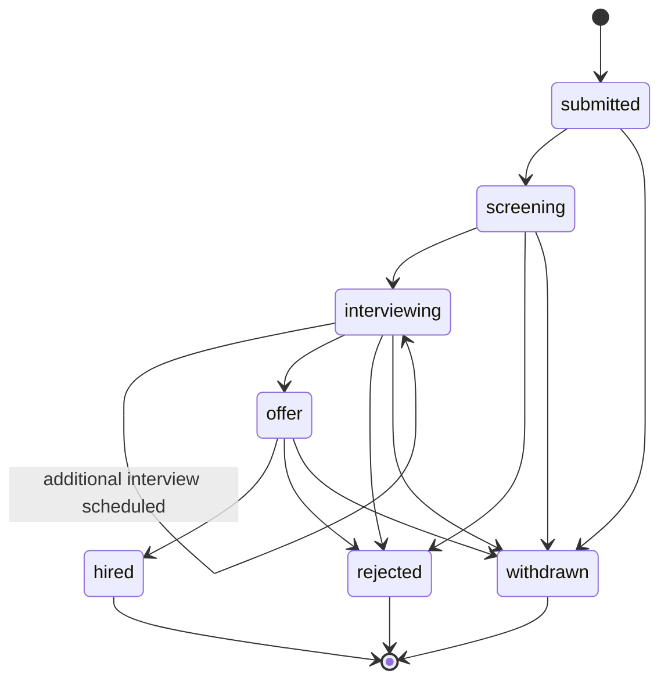

# 04 — Invariants

**Purpose:** State the rules that must always hold, regardless of implementation detail, and how each is enforced and tested.

**Depends on:** [03-ontology.md](03-ontology.md) (invariants are statements about these entities and their relationships).
**Feeds into:** [05-data-model.md](05-data-model.md) (marks which invariants become DB constraints vs. application logic) and [06-architecture.md](06-architecture.md) (multi-tenancy and async design must not violate these).

---

## How to read this document

For each invariant: **what it guarantees**, **what enforces it**, **what happens if violated**, and **how it's tested**. Enforcement is called out as DB-layer, application-layer, or both — the split is finalized in [05-data-model.md](05-data-model.md).

## Data ownership and isolation invariants

### I1 — A Resume always belongs to exactly one Candidate
- **Enforced by:** Foreign key `resumes.candidate_id NOT NULL`, no nullable/orphan state permitted (DB layer).
- **If violated:** Orphaned or ambiguous resume data — parsing/analysis output can't be attributed, breaking the core value prop.
- **Tested by:** Constraint-level test (insert without candidate_id fails); integration test asserting every upload flow creates or reuses a Candidate before a Resume row exists.

### I2 — A Candidate's PII is never visible across Organization boundaries
- **Enforced by:** Every PII-bearing Postgres table carries `organization_id`; row-level security (RLS) policy at the DB layer scopes all reads to the requesting user's organization (application layer sets session context; DB layer enforces it — belt and suspenders). See multi-tenancy design in [06-architecture.md](06-architecture.md). **[Revised 2026-07-15]** The vector index no longer lives in Postgres — resume chunk text and embeddings (see [05-data-model.md](05-data-model.md)) live in Qdrant, one collection per Organization. RLS cannot cover a system that isn't Postgres, so this invariant's vector-side enforcement is now: (1) the requesting session's org context resolves which Qdrant collection a query is even allowed to touch, server-side, never from client input; (2) a redundant `organization_id` payload filter on every query as a backstop. The collection boundary is the primary mechanism — structurally, there is no query shape that can address another organization's collection without the server choosing to point at it. **[Revised 2026-07-16]** `transcripts`, `proctoring_sessions`, `proctoring_events`, `assignments`, `assignment_submissions`, and `verdicts` (see [05-data-model.md](05-data-model.md)) are all `organization_id`-scoped Postgres tables and covered by the same RLS mechanism — no new isolation surface, but `proctoring_events` in particular is called out explicitly here since it's the most sensitive data class this invariant now protects (biometric-adjacent signal data).
- **If violated:** Cross-tenant data leak — the most severe possible failure for this system, both legally and reputationally. A vector-search-specific violation is especially insidious: an unscoped similarity query wouldn't error, it would silently return another organization's candidates ranked by relevance.
- **Tested by:** Automated cross-tenant access test suite run on every deploy: authenticated as Org A, attempt to read every Org B entity by ID, assert 404/denied on all of them — including issuing a vector similarity search seeded with Org B resume content and asserting zero Org B chunks are ever returned to Org A, and asserting a forged/spoofed org_id in a request cannot redirect a query to another organization's Qdrant collection. This test class is treated as a release blocker, not a regular test.

### I3 — A JobRequisition, Candidate, and Application in a relationship all belong to the same Organization
- **Enforced by:** Application-layer validation at Application creation (Candidate.organization_id must equal JobRequisition.organization_id); reinforced by DB constraint where feasible (composite FK or check constraint, detailed in [05-data-model.md](05-data-model.md)).
- **If violated:** Would silently break I2 by creating a cross-org linkage.
- **Tested by:** Unit test on Application creation rejecting mismatched organization_ids.

## Lifecycle invariants

### I4 — An Interview Scorecard cannot be edited after Interview.status = "completed" without an audit trail entry
- **Enforced by:** Application-layer: once `scorecards.status = submitted`, further writes are rejected by the normal update path; a separate "amend" operation is required, which writes a new audit_log row referencing the original and the change (DB layer: `scorecards` rows are effectively append-only post-submission — no UPDATE granted on submitted rows at the DB role/permission level).
- **If violated:** Silent post-hoc editing of interview feedback — undermines the trustworthiness of the hiring record, which is the entire point of structured scorecards.
- **Tested by:** Integration test: submit a scorecard, attempt direct update, assert rejection; attempt amendment, assert both original and audit_log entry are preserved and queryable.

### I5 — An Application's status can only move along defined transitions (no arbitrary jumps)
- **Enforced by:** Application-layer state machine guard on every status write; DB-layer CHECK constraint restricting `status` to the enum of valid values (does not by itself prevent invalid *transitions*, only invalid *values* — transition validity is application-layer).
- **If violated:** Pipeline data becomes inconsistent (e.g., "hired" candidate with no interview history), breaking pipeline visibility, the core problem this system solves per [01-problem-space-and-scope.md](01-problem-space-and-scope.md).
- **Tested by:** State-machine unit tests enumerating every (from, to) pair, asserting only the valid ones succeed.

**Valid Application status transitions:**

`withdrawn` (candidate-initiated) is reachable from every non-terminal state; `rejected` (org-initiated) is reachable from `screening`, `interviewing`, and `offer` but not directly from `submitted` — a candidate must at least enter screening before rejection, ensuring every rejection has some minimal review step attached (a deliberate process rule, not just a data rule).

### I6 — A Resume moves through parsing states without skipping failure handling
- **Enforced by:** Application-layer: the parsing worker is the only writer of `resumes.status`; direct client writes to this field are not exposed via the API.
- **If violated:** A resume could appear `parsed` with no actual extracted data, silently degrading downstream analysis.
- **Tested by:** Worker unit tests asserting `parse_failed` is set (not left `parsing` indefinitely) on any extraction exception; a monitoring alert on Resumes stuck in `parsing` past a timeout threshold (operational enforcement, not test-time).

## Referential and business-rule invariants

### I7 — An Interview always references exactly one Application
- **Enforced by:** FK `interviews.application_id NOT NULL` (DB layer).
- **If violated:** Feedback becomes unattributable to a specific pipeline instance, breaking the hiring-manager summary use case.
- **Tested by:** Constraint-level test.

### I8 — A Scorecard exists for at most one Interview, and vice versa
- **Enforced by:** Unique constraint on `scorecards.interview_id` (DB layer).
- **If violated:** Ambiguous which scorecard is authoritative for an interview, breaking I4's amendment trail (which amendment applies to which original?).
- **Tested by:** Constraint-level test (insert second scorecard for same interview_id fails).

### I9 — Deleting/anonymizing a Candidate's PII (right-to-be-forgotten) does not delete aggregate pipeline analytics
- **Enforced by:** Application-layer deletion routine anonymizes PII fields (name, email, phone, resume file, free-text scorecard fields referencing the candidate by name) in place, rather than hard-deleting rows, preserving counts/status-transition timestamps needed for the success metrics in [00-ideation.md](00-ideation.md). Full detail in [08-privacy-and-compliance.md](08-privacy-and-compliance.md).
- **If violated:** Either PII persists after a deletion request (compliance failure) or historical pipeline analytics silently break (operational failure).
- **Tested by:** Integration test: trigger deletion, assert PII fields are anonymized, assert aggregate counts (e.g., requisition funnel numbers) are unchanged.

## AI pipeline invariants

### I10 — An AnalysisOutput is only ever generated from submitted Scorecards, never draft ones
- **Enforced by:** Application-layer: the LLM crew's data-fetch step queries `scorecards WHERE status = 'submitted'` exclusively; draft scorecards are never included in the context passed to the Summarizer or Reasoning agent, even partially.
- **If violated:** A hiring manager could see a summary reflecting an interviewer's still-editable, not-yet-finalized impressions as if they were final — undermining the same trust guarantee I4 protects for scorecards individually.
- **Tested by:** Integration test: create a draft scorecard alongside submitted ones for the same Application, trigger analysis, assert the draft's content does not appear in the generated output or the crew's retrieved context.

### I11 — RAG search and match results are always scoped to the requesting HR user's Organization, with no ranking or retrieval across the boundary
- **Enforced by:** Application-layer: every vector query is issued through a data-access path that resolves the session's `organization_id` to a specific Qdrant collection (`resumechunks_{org_id}`) before the similarity search runs, plus a redundant `organization_id` payload filter within that query. **[Revised 2026-07-15]** There is no DB-layer RLS backstop here — Qdrant is a separate system from Postgres — so the collection-per-organization structural boundary *is* the primary enforcement mechanism, not a supplement to one; see [06-architecture.md](06-architecture.md) for the full reasoning behind accepting this tradeoff.
- **If violated:** Same failure mode as I2, specifically surfaced through the search feature — the highest-risk new surface introduced by the RAG pipeline, since it's designed to actively surface and rank candidates rather than passively store them. With the isolation boundary now enforced structurally (separate collections) rather than by a DB policy engine, a violation would most likely stem from a collection-resolution bug (e.g., a job payload carrying the wrong org_id) rather than a missing filter — the test suite below is written to catch both.
- **Tested by:** Same cross-tenant test suite as I2, plus a dedicated case: seed Org A and Org B with semantically near-identical resumes in their respective Qdrant collections, run a search as Org A, assert only Org A's candidate appears regardless of similarity score, and assert that a request carrying a spoofed org_id cannot cause the search job to resolve to Org B's collection.

## Verdict-service invariants **[New 2026-07-16]**

Cover the three scored-assessment services introduced in [00-ideation.md](00-ideation.md) — Resume Analyzer, Interview Live Proctoring, and Interview Transcript + Assignment Reviewer — and the shared Scoring Engine → Verdict/Judge pipeline all three run through.

### I12 — A Verdict is never generated by the Judge agent without a preceding Scoring Engine result
- **Enforced by:** Application-layer: the verdict-generation task pipeline always runs the deterministic Scoring Engine step first and passes its structured sub-score/flag output into the Verdict/Judge agent's context; there is no code path that invokes the Judge agent without it. `verdicts.deterministic_score` is written before `verdicts.narrative` in the same generation run.
- **If violated:** The entire reason a deterministic scoring layer exists — auditable, reproducible sub-scores a human can inspect independent of what the LLM said — is silently bypassed, and a verdict becomes just an unstructured LLM opinion with a fake veneer of rigor. This is a trust failure, not just a data-quality one.
- **Tested by:** Integration test asserting the Judge agent is never invoked in a test double/mock without a preceding scoring-engine call in the same request; a verdict-generation run forced to skip the scoring step is asserted to fail closed (no verdict written), not fall back to an LLM-only verdict.

### I13 — Proctoring signal data is retained only for its defined (shorter) biometric-data retention window and is purged by the same routine that implements I9
- **Enforced by:** Application-layer: `proctoring_events` (and any external recording reference on `proctoring_sessions`) are subject to a retention window shorter than general candidate PII, per [08-privacy-and-compliance.md](08-privacy-and-compliance.md), enforced by both a scheduled retention job and the I9 deletion routine.
- **If violated:** Biometric-adjacent data outlives its legal retention basis independent of whether any deletion request was ever made — a standing compliance violation, not a one-time incident.
- **Tested by:** Integration test asserting `proctoring_events` older than the retention window are purged by the scheduled job, and asserting an explicit I9 deletion request purges all of a candidate's `proctoring_events` immediately regardless of the standing retention window.

### I14 — A Transcript/Assignment Verdict may only be generated once the Interview it concerns has reached `completed` status
- **Enforced by:** Application-layer: the verdict-generation task checks `Interview.status == completed` before running the Transcript/Assignment Reviewer's Scoring Engine + Judge steps — the same "only from a finished, not in-progress, artifact" pattern I10 already applies to Scorecards.
- **If violated:** A verdict could be generated against a transcript that doesn't represent a finished interview (e.g., a `cancelled` or `no_show` Interview with a stray partial transcript), producing a misleading assessment attached to a real Application.
- **Tested by:** Integration test attempting verdict generation against a `scheduled`, `cancelled`, or `no_show` Interview, asserting rejection with no Verdict row written.

### I15 — Interview proctoring analysis is always asynchronous and advisory; it never intervenes in, pauses, or alters a live interview
- **Enforced by:** Architecture-layer: proctoring signal ingestion is webhook/bot/recording-pull based against an *external* video platform (Sift never hosts the call — see [06-architecture.md](06-architecture.md)), and the Verdict/Judge agent runs only after the interview ends. No API or code path exists through which a proctoring signal could act back on a live interview session.
- **If violated:** This is the single highest-liability failure mode this pivot introduces — an automated system pausing, warning, ending, or otherwise acting on a real, live interview (or auto-disqualifying a candidate) without human review. It is the exact scenario the "real-time proctoring intervention" line item is permanently excluded for in [01-problem-space-and-scope.md](01-problem-space-and-scope.md)'s Scope Creep Watchlist, not a temporary v1 gap.
- **Tested by:** Architectural/code-review check that no synchronous callback capability from the proctoring pipeline into a live interview session exists anywhere in the codebase, plus an explicit test in the proctoring suite asserting the ingestion/analysis path has no dependency that could reach a live session.

## Open Questions

- Should I5's rule "rejection requires passing through screening" be configurable per organization, or is it a fixed process guarantee we're comfortable enforcing universally in v1?
- For I4, what is the maximum allowed window for the *original* scorecard submission itself to be treated as a draft-in-progress vs. requiring the amendment path — is same-day editing before "submit" unlimited, or time-boxed?
- Does I2 need to additionally guard against organization_id spoofing at the API layer (e.g., a compromised client sending a different org_id), or is session-derived org context (never client-supplied) sufficient — this should be confirmed as a hard requirement in [06-architecture.md](06-architecture.md).
- For I10, should a hiring manager be able to see a count of "N scorecards still in draft" alongside the analysis output (metadata, not content) so they know the summary may be incomplete, without violating the spirit of I4/I10?
- For I11, does the LLM crew's Reasoning agent itself need a hard technical guardrail (not just a data-scoping one) preventing it from ever being prompted with cross-org context in a single call, as defense-in-depth beyond the retrieval scoping?
- **New in this revision:** should I12's "no Judge without a Scoring Engine result" also require a *minimum* deterministic sub-score coverage (e.g., the Judge cannot run if the Scoring Engine produced zero usable sub-scores due to missing input data), rather than merely requiring the step to have run at all?
- **New in this revision:** what exactly is the retention window for I13 — this is a **[NEEDS LEGAL REVIEW]** question in [08-privacy-and-compliance.md](08-privacy-and-compliance.md), not yet a number this invariant can be tested against precisely.
- **New in this revision:** does I15 need a technical guardrail beyond "no code path exists" — e.g., should the proctoring ingestion service run in network isolation from anything capable of calling the video platform's session-control APIs (mute, remove participant, end meeting), as defense-in-depth against a future accidental integration rather than relying solely on "we didn't build that feature"?
