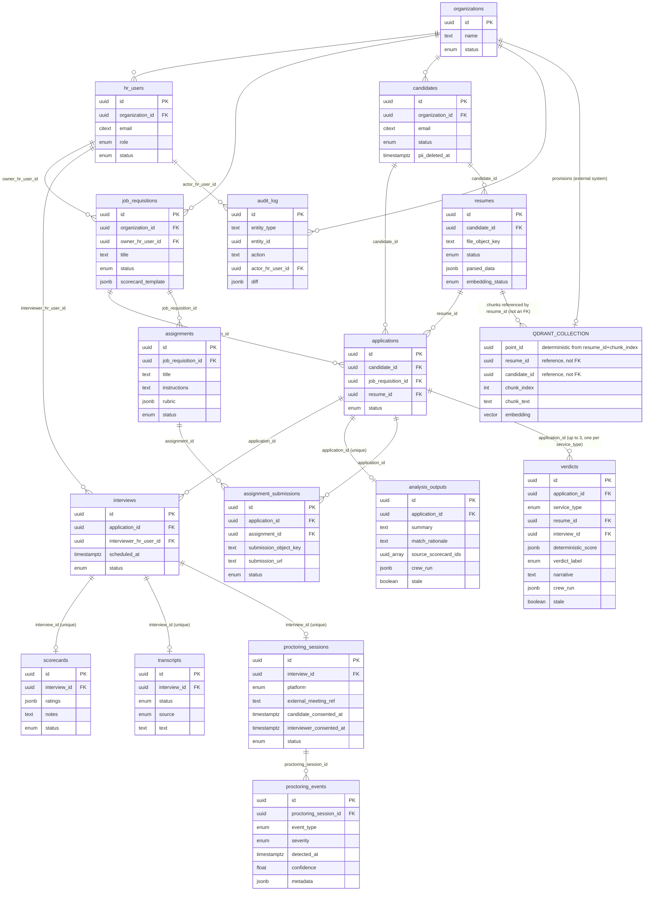

# 05 — Data Model

**Purpose:** Translate the ontology into a concrete schema — tables, fields, types, and constraints — and state which invariants are enforced where.

**Depends on:** [03-ontology.md](03-ontology.md) (entities and relationships) and [04-invariants.md](04-invariants.md) (which rules become constraints).
**Feeds into:** [06-architecture.md](06-architecture.md) (storage layer design) and [07-technical-stack.md](07-technical-stack.md) (concrete DB choice).

> **Revision note (2026-07-15):** the vector index (`resume_chunks`) moved out of Postgres entirely, into a dedicated Qdrant vector store with one collection per Organization. This reverses the 2026-07-14 pivot's "pgvector inside Postgres" decision — see [06-architecture.md](06-architecture.md) for the isolation-design tradeoff and [CHANGELOG.md](../CHANGELOG.md) for when this changed. Everything below the "Vector store" section is unchanged relational schema; `resume_chunks` as a Postgres table no longer exists.

---

## Conventions

- All Postgres tables have `id UUID PRIMARY KEY DEFAULT gen_random_uuid()` and `created_at`, `updated_at TIMESTAMPTZ` unless noted.
- All tenant-scoped tables carry `organization_id UUID NOT NULL REFERENCES organizations(id)` and are covered by a Postgres row-level security policy keyed on it (enforces **I2**).
- Enum-typed columns use Postgres native `ENUM` types for DB-layer value validation; *transition* validity (which enum-to-enum moves are legal) is application-layer per **I5**.
- Postgres now holds only relational data. The vector index lives in Qdrant, a separate system — see the "Vector store" section below and [06-architecture.md](06-architecture.md) for why.

## Postgres schema

### organizations
| Field | Type | Constraints |
|---|---|---|
| id | UUID | PK |
| name | TEXT | NOT NULL |
| status | ENUM(active, suspended, deactivated) | NOT NULL, DEFAULT 'active' |
| created_at, updated_at | TIMESTAMPTZ | NOT NULL |

*Creating an Organization also provisions its dedicated Qdrant collection (see below); deactivating one triggers that collection's teardown — this lifecycle coupling is new in this revision.*

### hr_users
| Field | Type | Constraints |
|---|---|---|
| id | UUID | PK |
| organization_id | UUID | NOT NULL, FK → organizations |
| email | CITEXT | NOT NULL, UNIQUE per organization_id (composite unique constraint) |
| full_name | TEXT | NOT NULL |
| role | ENUM(hr_generalist, recruiter, hiring_manager) | NOT NULL |
| status | ENUM(invited, active, deactivated) | NOT NULL, DEFAULT 'invited' |
| created_at, updated_at | TIMESTAMPTZ | NOT NULL |

*Enforces I2 (RLS root) and A2/A3 (single-org membership, fixed role enum) from [02-assumptions.md](02-assumptions.md).*

### job_requisitions
| Field | Type | Constraints |
|---|---|---|
| id | UUID | PK |
| organization_id | UUID | NOT NULL, FK → organizations |
| title | TEXT | NOT NULL |
| department | TEXT | nullable (free-text, per ontology decision to not model Department as an entity) |
| owner_hr_user_id | UUID | NOT NULL, FK → hr_users |
| status | ENUM(draft, open, on_hold, filled, cancelled) | NOT NULL, DEFAULT 'draft' |
| scorecard_template | JSONB | NOT NULL — defines the competency fields interviewers will rate (supports A11's "default set, definable per requisition") |
| created_at, updated_at | TIMESTAMPTZ | NOT NULL |

### candidates
| Field | Type | Constraints |
|---|---|---|
| id | UUID | PK |
| organization_id | UUID | NOT NULL, FK → organizations |
| email | CITEXT | NOT NULL, UNIQUE per organization_id (enforces A8 dedup key) |
| full_name | TEXT | NOT NULL |
| phone | TEXT | nullable |
| status | ENUM(active, archived, deleted) | NOT NULL, DEFAULT 'active' |
| pii_deleted_at | TIMESTAMPTZ | nullable — set when I9's anonymization routine runs |
| created_at, updated_at | TIMESTAMPTZ | NOT NULL |

*On `status = deleted`: application-layer routine overwrites `full_name`, `email`, `phone` with anonymized placeholders and sets `pii_deleted_at`, satisfying I9 without deleting the row (preserves FK integrity for historical applications/scorecards).*

### resumes
| Field | Type | Constraints |
|---|---|---|
| id | UUID | PK |
| organization_id | UUID | NOT NULL, FK → organizations (denormalized from candidate for RLS simplicity) |
| candidate_id | UUID | NOT NULL, FK → candidates (**enforces I1**) |
| file_object_key | TEXT | NOT NULL — pointer to object storage, not the file itself |
| status | ENUM(uploaded, parsing, parsed, parse_failed) | NOT NULL, DEFAULT 'uploaded' |
| parsed_data | JSONB | nullable — structured extraction: work history, education, skills |
| parse_error | TEXT | nullable |
| embedding_status | ENUM(not_embedded, embedding, embedded, embed_failed) | NOT NULL, DEFAULT 'not_embedded' — **new in this revision**: with `resume_chunks` no longer a Postgres table, this column is the only Postgres-side signal for "is this resume searchable," so a query like "resumes pending embedding" doesn't require a round trip to Qdrant |
| embedding_error | TEXT | nullable |
| created_at, updated_at | TIMESTAMPTZ | NOT NULL |

## Vector store (Qdrant — outside Postgres)

Resume chunk text and its embedding no longer live in a Postgres table. Instead: **one Qdrant collection per Organization**, provisioned when the Organization row is created and torn down when it's deactivated/deleted.

**Why collection-per-organization, not one shared collection with an `organization_id` payload filter:** Qdrant's documented multitenancy pattern is a single collection with a payload field + payload index, filtered per query — more resource-efficient at large tenant counts. This project deliberately trades that efficiency for a *structural* isolation boundary instead, mirroring the reasoning that made Postgres RLS the I2 enforcement mechanism in the first place: a query that only ever touches its own organization's collection cannot leak cross-org data through a missing or buggy filter, because there is no shared address space to filter within. Given I2's own framing ("the most severe possible failure for this system, both legally and reputationally"), the collection boundary is treated as non-negotiable for v1; a shared-collection-with-payload-filter model is not reconsidered unless collection-count operational overhead becomes a real problem at higher organization volumes than A14 anticipates.

**Collection naming:** `resumechunks_{organization_id}` — deterministic from the Organization's UUID, resolved server-side from the authenticated session's org context, exactly like the RLS session variable was — never accepted as a client-supplied parameter.

**Point schema (per chunk):**

| Field | Type | Notes |
|---|---|---|
| id (point ID) | UUID, deterministic from `(resume_id, chunk_index)` | Enables idempotent upsert/replace on re-embedding without a separate lookup. |
| vector | 1024-dim float array | `voyage-3` embedding, per [07-technical-stack.md](07-technical-stack.md) — unchanged by this revision. |
| payload.organization_id | UUID | Redundant with the collection boundary by design — a belt-and-suspenders filter applied on every query, matching I2's own "belt and suspenders" language, in case a collection-resolution bug is ever introduced. |
| payload.resume_id | UUID | References `resumes.id` in Postgres — not an enforced FK (cross-system), so the embedding worker is the sole writer responsible for consistency. |
| payload.candidate_id | UUID | References `candidates.id`, denormalized for result display without a Postgres join on the hot search path. |
| payload.chunk_index | INT | Ordinal position within the resume's chunked text. |
| payload.chunk_text | TEXT | The source text this vector represents — needed to show retrieval provenance in search results, same purpose the old `resume_chunks.chunk_text` column served. |
| payload.embedded_at | TIMESTAMPTZ (ISO string) | When this point was written. |

Collection config: distance metric `cosine` (unchanged from the prior HNSW `vector_cosine_ops` choice), vector size `1024`.

*On Resume re-parse/re-embed: existing points for that `resume_id` are deleted and replaced (deterministic point IDs make this a plain upsert), not versioned — chunk history has no independent value once superseded, same behavior as the prior pgvector design.*
*On Candidate PII deletion (I9): all points for the candidate's resumes are deleted from the org's Qdrant collection as part of the deletion routine, since `chunk_text` is derived directly from the resume content being purged — see the updated flow in [08-privacy-and-compliance.md](08-privacy-and-compliance.md), including the new two-system consistency risk this split introduces.*

### applications
| Field | Type | Constraints |
|---|---|---|
| id | UUID | PK |
| organization_id | UUID | NOT NULL, FK → organizations |
| candidate_id | UUID | NOT NULL, FK → candidates |
| job_requisition_id | UUID | NOT NULL, FK → job_requisitions |
| resume_id | UUID | NOT NULL, FK → resumes — pinned snapshot reference per ontology note, not a live pointer |
| status | ENUM(submitted, screening, interviewing, offer, hired, rejected, withdrawn) | NOT NULL, DEFAULT 'submitted' |
| created_at, updated_at | TIMESTAMPTZ | NOT NULL |

Constraints:
- `UNIQUE (candidate_id, job_requisition_id) WHERE status NOT IN ('rejected', 'withdrawn')` — enforces "at most one *active* Application per (Candidate, JobRequisition)" while allowing reapplication after a terminal outcome.
- CHECK constraint (trigger, since it's cross-table) verifying `candidates.organization_id = job_requisitions.organization_id = applications.organization_id` — DB-layer reinforcement of **I3** (primary enforcement remains application-layer at creation time).

### interviews
| Field | Type | Constraints |
|---|---|---|
| id | UUID | PK |
| organization_id | UUID | NOT NULL, FK → organizations |
| application_id | UUID | NOT NULL, FK → applications (**enforces I7**) |
| interviewer_hr_user_id | UUID | NOT NULL, FK → hr_users |
| scheduled_at | TIMESTAMPTZ | NOT NULL |
| status | ENUM(scheduled, completed, cancelled, no_show) | NOT NULL, DEFAULT 'scheduled' |
| created_at, updated_at | TIMESTAMPTZ | NOT NULL |

### scorecards
| Field | Type | Constraints |
|---|---|---|
| id | UUID | PK |
| organization_id | UUID | NOT NULL, FK → organizations |
| interview_id | UUID | NOT NULL, UNIQUE, FK → interviews (**enforces I8**) |
| ratings | JSONB | NOT NULL — keyed to the owning requisition's `scorecard_template` |
| notes | TEXT | nullable |
| status | ENUM(draft, submitted, amended) | NOT NULL, DEFAULT 'draft' |
| submitted_at | TIMESTAMPTZ | nullable |
| created_at, updated_at | TIMESTAMPTZ | NOT NULL |

*Row-level UPDATE is revoked at the DB role level once `status = submitted` for all fields except via the amendment stored procedure, which writes to `audit_log` in the same transaction — DB-layer enforcement of **I4**.*

### analysis_outputs
The cached result of the LLM crew running over an Application — a derived artifact. Stays in Postgres; only the raw vector/chunk data moved to Qdrant.

| Field | Type | Constraints |
|---|---|---|
| id | UUID | PK |
| organization_id | UUID | NOT NULL, FK → organizations |
| application_id | UUID | NOT NULL, UNIQUE, FK → applications, ON DELETE CASCADE — one current output per Application, overwritten on regeneration |
| summary | TEXT | NOT NULL — Summarizer agent output |
| match_rationale | TEXT | nullable — Reasoning agent output when generated against a specific JobRequisition's criteria |
| source_scorecard_ids | UUID[] | NOT NULL — the exact set of submitted Scorecards this output was generated from (**enforces I10**'s auditability) |
| crew_run | JSONB | NOT NULL — records which model handled each agent role and prompt/response metadata for reproducibility (e.g., `{"extraction": "claude-haiku-4-5", "summarization": "claude-sonnet-5", "reasoning": "claude-opus-4-8"}`) |
| generated_at | TIMESTAMPTZ | NOT NULL |
| stale | BOOLEAN | NOT NULL, DEFAULT false — flipped true when a new Scorecard is submitted for this Application after `generated_at` |

*Regenerated in place (upsert on `application_id`), not versioned.*

### audit_log
| Field | Type | Constraints |
|---|---|---|
| id | UUID | PK |
| organization_id | UUID | NOT NULL, FK → organizations |
| entity_type | TEXT | NOT NULL (e.g., 'scorecard') |
| entity_id | UUID | NOT NULL |
| action | TEXT | NOT NULL (e.g., 'amended') |
| actor_hr_user_id | UUID | NOT NULL, FK → hr_users |
| diff | JSONB | NOT NULL — before/after of amended fields |
| created_at | TIMESTAMPTZ | NOT NULL |

Append-only by convention (no UPDATE/DELETE grants at the DB role level) — this table is itself the enforcement mechanism for I4's audit trail requirement.

## Verdict-service tables **[New 2026-07-16]**

Support the three scored-assessment services in [00-ideation.md](00-ideation.md). All are `organization_id`-scoped Postgres tables covered by RLS (I2), same as every table above — no new isolation mechanism, just more tables under the existing one.

### transcripts
| Field | Type | Constraints |
|---|---|---|
| id | UUID | PK |
| organization_id | UUID | NOT NULL, FK → organizations |
| interview_id | UUID | NOT NULL, UNIQUE, FK → interviews |
| status | ENUM(pending, available, unavailable) | NOT NULL, DEFAULT 'pending' |
| source | ENUM(platform_provided, generated_stt) | nullable — set once `status = available` |
| text | TEXT | nullable — populated once ingested |
| language | TEXT | nullable |
| created_at, updated_at | TIMESTAMPTZ | NOT NULL |

### proctoring_sessions
| Field | Type | Constraints |
|---|---|---|
| id | UUID | PK |
| organization_id | UUID | NOT NULL, FK → organizations |
| interview_id | UUID | NOT NULL, UNIQUE, FK → interviews |
| platform | ENUM(zoom, google_meet, teams, other) | NOT NULL |
| external_meeting_ref | TEXT | nullable — the video platform's own meeting/recording identifier; never the raw media itself (see "not first-class" note in [03-ontology.md](03-ontology.md)) |
| candidate_consented_at | TIMESTAMPTZ | nullable — **enforces the candidate half of A22's consent gate**; ingestion may not begin until set |
| interviewer_consented_at | TIMESTAMPTZ | nullable — the interviewer/HR-user half of the same gate |
| status | ENUM(not_configured, consent_pending, active, analyzing, completed, failed) | NOT NULL, DEFAULT 'not_configured' |
| failure_reason | TEXT | nullable |
| created_at, updated_at | TIMESTAMPTZ | NOT NULL |

*Application-layer enforcement: signal ingestion (creating any `proctoring_events` row) is rejected unless both `candidate_consented_at` and `interviewer_consented_at` are set — the concrete enforcement point for A22.*

### proctoring_events
| Field | Type | Constraints |
|---|---|---|
| id | UUID | PK |
| organization_id | UUID | NOT NULL, FK → organizations |
| proctoring_session_id | UUID | NOT NULL, FK → proctoring_sessions |
| event_type | ENUM(multiple_faces_detected, face_not_detected, gaze_away, voice_mismatch, background_voice_detected, other) | NOT NULL |
| severity | ENUM(info, warning, critical) | NOT NULL |
| detected_at | TIMESTAMPTZ | NOT NULL — timestamp within the interview the signal occurred |
| confidence | FLOAT | nullable — detection-vendor confidence score, where available |
| metadata | JSONB | NOT NULL, DEFAULT '{}' — vendor-specific detail |
| created_at | TIMESTAMPTZ | NOT NULL |

No `updated_at` — append-only by the same convention as `audit_log` (no UPDATE/DELETE exposed anywhere in the API); this is the highest-volume table in the schema and the most sensitive data class I2 protects, per its 2026-07-16 revision note in [04-invariants.md](04-invariants.md). Subject to the shorter retention window in [08-privacy-and-compliance.md](08-privacy-and-compliance.md) (**I13**) — "append-only" governs mutation, not retention; the retention job deletes rows outright once their window expires.

### assignments
| Field | Type | Constraints |
|---|---|---|
| id | UUID | PK |
| organization_id | UUID | NOT NULL, FK → organizations |
| job_requisition_id | UUID | NOT NULL, FK → job_requisitions |
| title | TEXT | NOT NULL |
| instructions | TEXT | NOT NULL |
| rubric | JSONB | NOT NULL — competency criteria the Scoring Engine and Verdict/Judge agent score submissions against |
| status | ENUM(draft, published, archived) | NOT NULL, DEFAULT 'draft' |
| created_at, updated_at | TIMESTAMPTZ | NOT NULL |

### assignment_submissions
| Field | Type | Constraints |
|---|---|---|
| id | UUID | PK |
| organization_id | UUID | NOT NULL, FK → organizations |
| application_id | UUID | NOT NULL, FK → applications |
| assignment_id | UUID | NOT NULL, FK → assignments |
| submission_object_key | TEXT | nullable — file in object storage, namespaced like `resumes.file_object_key` |
| submission_url | TEXT | nullable — e.g. a repository link, per A26 (no code execution) |
| status | ENUM(submitted, reviewed) | NOT NULL, DEFAULT 'submitted' |
| created_at, updated_at | TIMESTAMPTZ | NOT NULL |

Constraints:
- `UNIQUE (application_id, assignment_id)` — at most one active submission per pair in v1; resubmission behavior (overwrite vs. new row) is an open question carried from [03-ontology.md](03-ontology.md).
- CHECK constraint (trigger, cross-table, same I3 pattern as `applications`) verifying `applications.organization_id = assignments.organization_id` via the shared `job_requisition_id` lineage.

### verdicts
| Field | Type | Constraints |
|---|---|---|
| id | UUID | PK |
| organization_id | UUID | NOT NULL, FK → organizations |
| application_id | UUID | NOT NULL, FK → applications |
| service_type | ENUM(resume_analysis, interview_proctoring, transcript_assignment_review) | NOT NULL |
| resume_id | UUID | nullable, FK → resumes — set iff `service_type = resume_analysis` |
| interview_id | UUID | nullable, FK → interviews — set iff `service_type IN (interview_proctoring, transcript_assignment_review)` |
| deterministic_score | JSONB | NOT NULL — the Scoring Engine's structured sub-scores/flags; **must be written before this row's `narrative` is populated (enforces I12)** |
| verdict_label | ENUM(pass, review, fail) | NOT NULL |
| narrative | TEXT | NOT NULL — the Verdict/Judge agent's explanation |
| crew_run | JSONB | NOT NULL — model provenance, same convention as `analysis_outputs.crew_run` |
| generated_at | TIMESTAMPTZ | NOT NULL |
| stale | BOOLEAN | NOT NULL, DEFAULT false — flipped true when an input the verdict depended on changes after `generated_at` (e.g., a new Scorecard, a resubmitted Assignment) |
| created_at, updated_at | TIMESTAMPTZ | NOT NULL |

Constraints:
- `UNIQUE (application_id, service_type)` — at most one *current* Verdict per Application per service, per the ontology's "up to three Verdicts, never a blended one" design.
- CHECK constraint (trigger) enforcing the `resume_id`/`interview_id` exclusivity rule above, and that whichever is set belongs to the same `organization_id` and, transitively, the same `application_id` — the I3 pattern extended to this table.
- CHECK constraint on `verdict_label` restricting it to the fixed 3-tier vocabulary — deliberately not a numeric score, matching the "narrative over bare number" posture stated in [00-ideation.md](00-ideation.md).

## Schema-level ER diagram

## Invariant enforcement summary

| Invariant | DB layer | Application layer |
|---|---|---|
| I1 (Resume → one Candidate) | FK NOT NULL | — |
| I2 (no cross-org PII) | RLS policy on every Postgres tenant table; on the vector side, physical collection-per-organization separation in Qdrant | Session context sets org scope for both Postgres RLS and Qdrant collection resolution; never trusts client-supplied org_id for either |
| I3 (same-org relationships) | Trigger-based CHECK across FKs | Primary validation at Application creation |
| I4 (Scorecard immutability) | UPDATE revoked post-submit; amendment via stored procedure | Amendment endpoint writes audit_log in same transaction |
| I5 (valid status transitions) | CHECK constraint on enum values only | State-machine guard on every transition |
| I6 (Resume parse state integrity) | — | Worker is sole writer of `resumes.status`; not client-exposed |
| I7 (Interview → one Application) | FK NOT NULL | — |
| I8 (Scorecard ↔ Interview 1:1) | UNIQUE constraint | — |
| I9 (deletion preserves aggregates) | Anonymization overwrites fields in place, no row deletion | Deletion routine orchestrates the Postgres overwrite + the Qdrant point deletion |
| I10 (AnalysisOutput reflects only submitted Scorecards) | `source_scorecard_ids` column makes the input set auditable after the fact | Crew's data-fetch step filters to `status = 'submitted'` before generation |
| I11 (RAG search never crosses org boundary) | No RLS available in Qdrant (not Postgres) — enforced by collection-per-organization physical separation, plus a redundant `organization_id` payload filter on every query | Data-access layer resolves the org's collection name from session context, never from client input; payload filter applied as belt-and-suspenders |
| I12 (Verdict never generated without a Scoring Engine result) | `verdicts.deterministic_score` is `NOT NULL` — a row cannot exist without it | Generation pipeline always runs the Scoring Engine before the Judge agent; no code path calls the Judge without it |
| I13 (proctoring data retention) | — | Scheduled retention job + I9 deletion routine both purge `proctoring_events` past the (legal-review-pending) retention window |
| I14 (Transcript/Assignment Verdict only after Interview completed) | — | Generation pipeline checks `Interview.status = completed` before running |
| I15 (proctoring never intervenes live) | — (no DB mechanism applies to an architectural non-existence guarantee) | No API/code path from the proctoring ingestion pipeline back into a live interview session — architecture-level, verified by code review |

## Open Questions

- Should `scorecard_template` live on `job_requisitions` (as modeled) or be an organization-level default with per-requisition override — current design assumes per-requisition is the primary unit, confirm this matches A11.
- Is JSONB sufficient for `parsed_data` and `ratings` long-term, or will query patterns demand promoting specific fields to indexed columns sooner than expected?
- Does `audit_log` need partitioning/archival strategy from day one given it's append-only and will grow unbounded, or is this a v2 operational concern?
- Is a fixed chunk size/overlap strategy for the Qdrant points (not yet specified numerically here) something to lock down in this doc, or is it an implementation-detail tuning parameter that belongs in the ingestion service's own config?
- Should the embedding vector dimension (1024, tied to `voyage-3`) be treated as a schema/collection-config migration risk — swapping embedding models later requires provisioning new collections and re-embedding every point, this time across every organization's collection rather than a single shared table.
- **New in this revision:** Qdrant collection provisioning/teardown is now coupled to Organization lifecycle (create → provision, deactivate/delete → teardown). What happens to an Organization's collection during a `suspended` state — paused/read-only, or untouched until `deactivated`? This needs a decision before E3's org lifecycle work is implemented.
- **New in this revision:** deletion (I9) now spans two systems (Postgres anonymization + Qdrant point deletion) instead of one transactional DB. What is the compensating action if the Qdrant delete call fails after the Postgres transaction commits (or vice versa) — retry queue, reconciliation job, or treat as a monitored/alerted exception path? See [08-privacy-and-compliance.md](08-privacy-and-compliance.md).
- **New 2026-07-16:** should `proctoring_events` be partitioned (e.g., by month, or by organization) from day one given it's the highest-write-volume table in the schema and subject to a short, hard retention deadline (I13) — unlike `audit_log`'s "defer partitioning to v2" answer above, a short retention window makes partition-based bulk deletion (drop old partitions) meaningfully more attractive than row-by-row deletes here.
- **New 2026-07-16:** is `verdicts.deterministic_score`'s JSONB shape stable enough across all three `service_type` values to be queried/reported on meaningfully (e.g., "average resume-fit sub-score across all Applications for a requisition"), or does each service_type need its own typed sub-score columns once reporting requirements are known?
- **New 2026-07-16:** should `assignment_submissions` support multiple rows per (Application, Assignment) instead of the `UNIQUE` constraint above, to preserve resubmission history the way Scorecard amendments preserve the original — currently unresolved, carried from the same open question in [03-ontology.md](03-ontology.md).
- **New 2026-07-16:** the CHECK constraint on `verdicts` enforcing `resume_id`/`interview_id` exclusivity by `service_type` needs its exact trigger logic designed during implementation (E15) — this doc states the rule, not the SQL, deliberately, since it depends on how E15 structures the migration.
