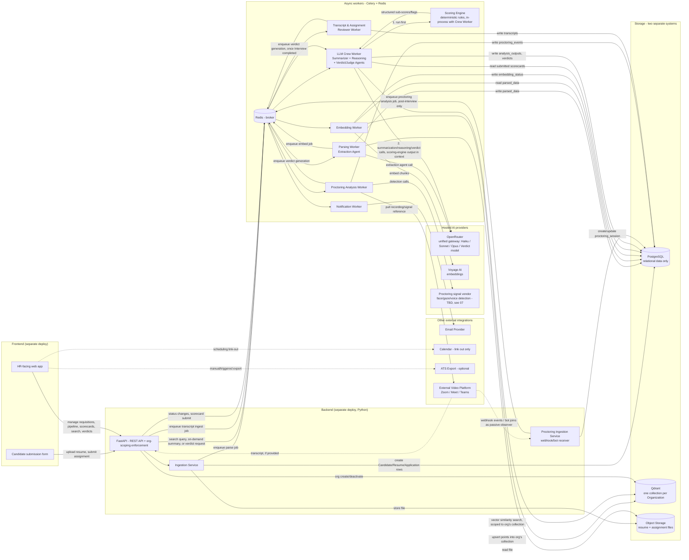
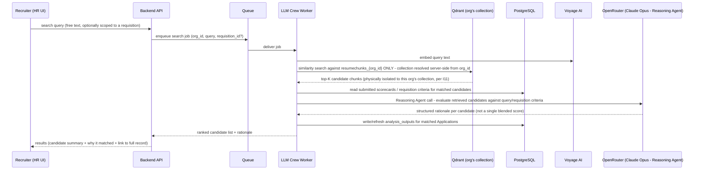
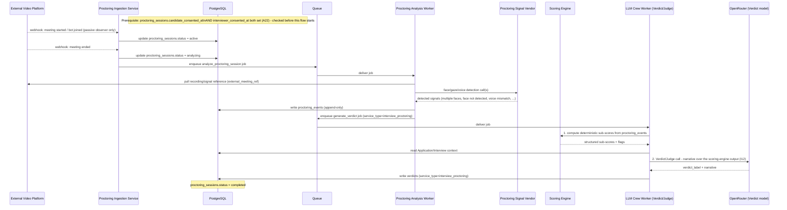
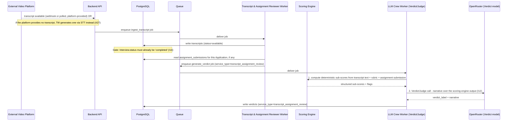

# 06 — Architecture

**Purpose:** Define the system's components, how data flows through them, what runs synchronously vs. asynchronously, and how multi-tenancy is enforced.

**Depends on:** [05-data-model.md](05-data-model.md) (storage shape) and [04-invariants.md](04-invariants.md) (I2/I11 in particular drive the multi-tenancy and vector-isolation design).
**Feeds into:** [07-technical-stack.md](07-technical-stack.md) (concrete technology choices for each component below).

> **Revision note (2026-07-15):** the vector index moved from pgvector-inside-Postgres to a dedicated Qdrant vector store, with one collection per Organization. This reverses the 2026-07-14 pivot's explicit "why not a dedicated vector database" argument — see the Multi-tenancy section below for the honest accounting of that reversal, and [CHANGELOG.md](../CHANGELOG.md) for when this changed.

> **Revision note (2026-07-16):** two changes. (1) All LLM crew model calls — the existing Extraction/Summarizer/Reasoning agents and the new Verdict/Judge agent below — now route through **OpenRouter** as a single unified gateway instead of calling the Anthropic API directly; see [07-technical-stack.md](07-technical-stack.md). (2) Three new components support the scored-assessment services in [00-ideation.md](00-ideation.md): a Scoring Engine (deterministic rules, runs before every Judge-agent call per **I12**), a Proctoring Ingestion & Analysis path (webhook/bot/recording-pull from an external video platform — never a Sift-hosted call, per **I15**), and a Transcript & Assignment Reviewer path. See the new sequence diagrams below.

---

## Component overview

The frontend and backend are two separately deployable services in two different languages — the frontend never talks to the database, vector store, object storage, queue, or LLM/embedding providers directly, only to the backend's API.



## Component responsibilities

| Component | Responsibility | Notes |
|---|---|---|
| Frontend (Next.js) | HR dashboard, candidate submission form | Pure API client — no direct DB/vector-store/storage/AI access. |
| Backend API (FastAPI) | Auth validation, org-scoping enforcement, request/response schemas, synchronous writes | The single place org context is resolved from a session — used both to set the Postgres RLS session variable *and* to resolve which Qdrant collection a request is allowed to touch. |
| Ingestion Service | Resume upload handling: file storage + row creation + enqueue | Runs inline on the request path (not a separate deploy), synchronous. |
| Parsing Worker (Extraction Agent) | Text extraction from resume file + structured field extraction | Model call now routes through OpenRouter (see below) — otherwise unchanged by this revision; writes only to Postgres (`resumes.parsed_data`). |
| Embedding Worker | Chunks parsed resume text, generates vector embeddings, and upserts points into the candidate's **organization's Qdrant collection** | Writes to Qdrant, not Postgres, for the vector data itself; writes `resumes.embedding_status` back to Postgres so embedding completeness is queryable without a Qdrant round trip. |
| LLM Crew Worker (Extraction, Summarizer, Reasoning, **Verdict/Judge** agents) | Four jobs: (1) on-demand candidate/Application summary generation, (2) RAG search — retrieves relevant chunks, Reasoning agent produces a rationale, (3) **[New]** Resume Analyzer verdict, (4) **[New]** shared verdict-writing step for the Transcript/Assignment Reviewer and Proctoring services once their own workers hand off scoring-engine output | Orchestrated as one CrewAI crew (`app/crew/crew.py`), all four jobs sharing the same crew definition with different entry tasks. The Verdict/Judge agent is always preceded by a Scoring Engine call in the same job, per **I12** — never invoked standalone. |
| Scoring Engine | Deterministic, rule-based sub-score/flag computation per service type (resume fit, proctoring integrity, transcript/assignment competency) | Not a Celery worker of its own — runs in-process as the first step of whichever job (Crew Worker, Proctoring Analysis Worker, Transcript & Assignment Reviewer Worker) is generating a Verdict. Pure Python, no model calls, fully deterministic and unit-testable without mocking an LLM. |
| Proctoring Ingestion Service | Receives webhook events or a bot-observer feed from the external video platform for a specific Interview's `proctoring_session`; never joins as an active participant, never has session-control capability (per **I15**) | Runs inline on the request path (webhook receiver), synchronous acknowledgment, async everything downstream. |
| Proctoring Analysis Worker | Post-interview only: pulls the recording/signal reference, calls the proctoring signal vendor for face/gaze/voice detection, writes `proctoring_events`, hands off to the Scoring Engine + Verdict/Judge for the `interview_proctoring` Verdict | The vendor for face/gaze/voice detection is a **buy, not build** decision still open in [07-technical-stack.md](07-technical-stack.md) — this worker is a thin orchestrator around that vendor's API, not a from-scratch computer-vision pipeline. |
| Transcript & Assignment Reviewer Worker | Ingests the transcript (vendor-provided or generated via STT), reads any `assignment_submissions` for the Application, hands off to the Scoring Engine + Verdict/Judge for the `transcript_assignment_review` Verdict | Gated on `Interview.status = completed`, per **I14**. |
| Notification Worker | Sends transactional email on state changes | Unchanged. |
| PostgreSQL | All relational data: organizations, users, requisitions, candidates, resumes, applications, interviews, scorecards, analysis outputs, audit log, **and, new in this revision, transcripts, proctoring sessions/events, assignments/submissions, verdicts** | No vector/embedding data — see Multi-tenancy below for why that split was made. |
| Qdrant | The vector index: one collection per Organization, holding resume chunk text + embeddings | Hosted as Qdrant Cloud — see [07-technical-stack.md](07-technical-stack.md). |
| Object storage (S3) | Raw resume files, and now assignment submission files | Unchanged mechanism, extended scope. |

## Data flow: resume submission to searchable, analyzable record

```mermaid
sequenceDiagram
    participant C as Candidate
    participant API as Backend API (FastAPI)
    participant Obj as Object Storage
    participant DB as PostgreSQL
    participant Q as Queue (Redis/Celery)
    participant Par as Parsing Worker
    participant Emb as Embedding Worker
    participant LLM as OpenRouter (Claude Haiku)
    participant Vy as Voyage AI
    participant VDB as Qdrant (org's collection)

    C->>API: POST resume file + requisition_id
    API->>Obj: store raw file
    API->>DB: create/reuse Candidate, create Resume (status=uploaded), create Application (status=submitted)
    API-->>C: 202 Accepted (submission confirmed)
    API->>Q: enqueue parse_resume job

    Q->>Par: deliver parse_resume job
    Par->>Obj: fetch file
    Par->>LLM: Extraction Agent call (structured field extraction)
    Par->>DB: update Resume (status=parsed, parsed_data)
    Par->>Q: enqueue embed_resume job

    Q->>Emb: deliver embed_resume job
    Emb->>Emb: chunk parsed resume text
    Emb->>Vy: generate embeddings per chunk
    Emb->>VDB: upsert points (resume_id, chunk_index, chunk_text, embedding) into resumechunks_{org_id}
    Emb->>DB: update Resume (embedding_status=embedded)
    Note over VDB: Resume is now searchable via RAG, scoped to its own organization's collection
```

## Data flow: RAG search and candidate matching (recruiter-initiated)

This is the sequence for the "resume search & retrieval" capability in [01-problem-space-and-scope.md](01-problem-space-and-scope.md) — deliberately human-initiated per query, never a background batch process, per **I11**.



Three things worth calling out about this flow:
1. **Retrieval, then reasoning — never reasoning without retrieval scoping.** The vector search happens first, against a collection that *only ever contains this organization's data* — the Reasoning agent only ever sees chunks that already came from a physically isolated store, so there's no path where cross-org data reaches the LLM call.
2. **Collection name is resolved server-side, never accepted from the client.** The org_id that determines which Qdrant collection a job touches travels with the job payload from the authenticated session, the same trust boundary the Postgres RLS session variable used — a compromised or spoofed client-supplied org_id cannot redirect a query to another organization's collection because the collection name isn't derived from anything the client controls.
3. **Output is a rationale per candidate, not a single ranked score** — unchanged from the prior design, tied to the Scope Creep Watchlist boundary in [01-problem-space-and-scope.md](01-problem-space-and-scope.md).

## Data flow: interview live proctoring **[New 2026-07-16]**

"Live" describes the interview, not the analysis — proctoring is deliberately post-hoc and asynchronous end to end, per **I15**. Sift never joins the call as an active participant and never has any session-control capability over it.



## Data flow: interview transcript + assignment review **[New 2026-07-16]**



Note what both new flows share with the existing RAG search flow: **deterministic computation happens first, the large model only ever explains/contextualizes a structured result it's handed**, never scores from a blank slate. The Resume Analyzer verdict (not diagrammed separately) follows the identical pattern, triggered on-demand from the existing summary-generation entry point in the RAG search flow above, with the Scoring Engine step inserted before the Reasoning/Judge call.

## Synchronous vs. asynchronous boundary

| Operation | Sync or Async | Why |
|---|---|---|
| Resume file upload + record creation | Sync | Candidate needs immediate confirmation the submission was received. |
| Resume parsing (Extraction Agent) | Async | LLM call latency; not needed for submission confirmation. |
| Resume embedding (chunk + embed + upsert to Qdrant) | Async | Chained after parsing; no user is waiting on it synchronously. |
| Organization creation → Qdrant collection provisioning | Sync (the write itself) | An org shouldn't be usable before its collection exists; provisioning a Qdrant collection is a fast API call, not worth deferring to async. |
| Application status transitions (HR-initiated) | Sync (the write itself) | HR users expect immediate UI feedback. |
| Notifications triggered by status transitions | Async | Email delivery latency shouldn't block the HR user's UI action. |
| Scorecard submission | Sync (the write itself) | Interviewer needs confirmation before navigating away. |
| Candidate/Application summary generation (LLM Crew) | Async, on-demand, cached in `analysis_outputs` | Multi-step multi-model calls take seconds. |
| RAG search query | Async from the API's perspective (enqueued), but UX-interactive | The embed → retrieve → reason pipeline is multi-step and must not hold an HTTP connection open for tens of seconds. |
| ATS export (v2+) | Async | Bulk export operations should not block the initiating UI action. |
| Assignment submission (upload) | Sync | Candidate needs immediate confirmation, same reasoning as resume upload. |
| Proctoring signal ingestion (webhook receipt) | Sync acknowledgment of the webhook itself; async everything downstream | The video platform expects a fast webhook response; all actual analysis happens later via the queue. |
| Proctoring analysis (detection calls + Scoring Engine + Verdict/Judge) | Async, always post-interview, never during | The core guarantee of **I15** — there is no synchronous path here by design, not just by current implementation. |
| Transcript ingestion | Async | Triggered by a webhook/poll or an STT job, neither of which any user is waiting on synchronously. |
| Any Verdict generation (Resume Analyzer, Proctoring, Transcript/Assignment) | Async, on-demand or chained after the triggering event, cached in `verdicts` | Same reasoning as `analysis_outputs` — the Scoring Engine + Judge call sequence takes seconds, not something to hold an HTTP request open for. |

## Multi-tenancy approach

Two separate stateful systems now share the tenant-isolation responsibility (Postgres for relational data, Qdrant for vectors), plus shared object storage — defense in depth across all three, directly implementing **I2** and **I11** from [04-invariants.md](04-invariants.md):

1. **Application layer:** every authenticated request resolves to exactly one `organization_id` from the session/token — never accepted as a client-supplied parameter for scoping decisions. This org_id is used to (a) set the Postgres RLS session variable, and (b) resolve which Qdrant collection (`resumechunks_{org_id}`) a job is allowed to read or write. Same trust boundary, two different downstream mechanisms.
2. **Postgres layer:** Row-Level Security (RLS) policies on every tenant-scoped table, keyed to a session variable (`app.current_org_id`) set at the start of each request/job's DB transaction. Unchanged from the prior design.
3. **Qdrant layer:** **collection-per-organization** is the primary isolation mechanism — there is no cross-organization query path because each organization's vectors live in a distinct, separately-named collection, resolved server-side. A redundant `organization_id` payload filter is applied on every query as a backstop, mirroring RLS's belt-and-suspenders posture, in case a collection-resolution bug is ever introduced.
4. **Object storage layer:** file keys are namespaced by organization (`{org_id}/{resume_id}/{filename}`), unchanged.

**Why move the vector index out of Postgres into a dedicated Qdrant instance, reversing the 2026-07-14 decision?** That decision explicitly rejected a dedicated vector database specifically to avoid a second stateful system with its own tenant-isolation surface. This revision accepts that tradeoff deliberately, for two reasons the product now prioritizes: (1) purpose-built ANN performance and richer filtering/hybrid-search headroom as resume volume grows, without that workload competing with or degrading the primary OLTP Postgres instance's performance; (2) independent scaling of the vector workload (high write volume from chunking, different query patterns) from the relational workload. The added isolation surface is mitigated, not ignored: collection-per-organization gives Qdrant a *structural* isolation boundary analogous to what RLS gives Postgres, rather than relying solely on a payload filter that a future query could omit. This is a genuine tradeoff, not a free upgrade — Qdrant is now a second production dependency requiring its own operational ownership (backups, access control, provisioning lifecycle tied to Organization create/deactivate), and the I2/I11 cross-tenant test suite (see [09-roadmap.md](09-roadmap.md)) must now prove isolation across *two* systems instead of one. Revisit if collection-per-organization overhead becomes operationally unwieldy at higher organization counts than [02-assumptions.md](02-assumptions.md)'s A14 anticipates — the fallback would be the shared-collection-with-payload-filter pattern Qdrant itself recommends for multitenancy at scale.

## Open Questions

- Should the LLM Crew Worker's search jobs be rate-limited/queued per-organization to prevent one high-volume org from starving search latency for others?
- At what per-collection chunk volume, or at what total collection count across all organizations, does Qdrant's operational overhead (backup, provisioning, monitoring per collection) need revisiting — is collection-per-org still the right call at 100 organizations? At 10,000?
- Does the RAG search UX need a "streaming" response (partial results as the crew works) given the multi-step embed → retrieve → reason pipeline, or is a single loading state through to completion acceptable for v1?
- Should Extraction, Summarization, and Reasoning agents be separate Celery task types with independent retry/backoff policies, or one crew-orchestrated task treated as a single unit of work for retry purposes?
- **New in this revision:** what is the compensating action if Qdrant collection provisioning fails during Organization creation (Postgres row exists, Qdrant collection doesn't) — synchronous rollback of the Postgres transaction, or a retry/reconciliation job? This needs an answer before E3's org creation flow is implemented.
- **New 2026-07-16:** does the Proctoring Ingestion Service need to validate that inbound webhooks actually originate from the claimed video platform (signature verification) before creating/updating a `proctoring_session` — this is a real spoofing surface (a forged webhook could fabricate a proctoring session or, worse, forge consent-adjacent state) that needs a concrete answer before E-level implementation, not left implicit.
- **New 2026-07-16:** should the Proctoring Analysis Worker and Transcript & Assignment Reviewer Worker be separate Celery task/queue types from the existing Crew Worker (independent retry/backoff, independent scaling), or share the same worker process since they all ultimately hand off to the same crew definition for the Verdict/Judge step? The diagrams above show them as separate workers feeding the same Crew Worker queue — confirm this is the intended shape before E16/E19/E21 are implemented.
- **New 2026-07-16:** where does the Scoring Engine's rule configuration live — versioned in application code (per A23, "engineering-authored, not a no-code builder"), or in a config table so rules can be updated without a deploy? This doc assumes code, but it's not yet stated as a firm decision anywhere.
- **New 2026-07-16:** does OpenRouter's request/response shape require any change to how CrewAI's model-provenance recording (`crew_run` JSONB, e.g. `{"extraction": "claude-haiku-4-5", ...}`) works, given the model identifier now includes an OpenRouter routing prefix rather than a bare Anthropic model name — see [07-technical-stack.md](07-technical-stack.md).
