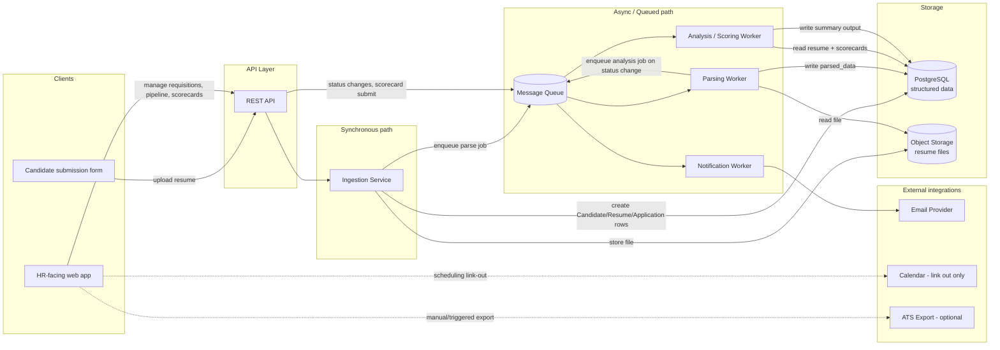

# 06 — Architecture

**Purpose:** Define the system's components, how data flows through them, what runs synchronously vs. asynchronously, and how multi-tenancy is enforced.

**Depends on:** [05-data-model.md](05-data-model.md) (storage shape) and [04-invariants.md](04-invariants.md) (I2 in particular drives the multi-tenancy design).
**Feeds into:** [07-technical-stack.md](07-technical-stack.md) (concrete technology choices for each component below).

---

## Component overview



## Data flow: resume submission to analyzed output

The end-to-end flow referenced in [00-ideation.md](00-ideation.md)'s success criteria and [02-assumptions.md](02-assumptions.md)'s latency assumption (A15):

```mermaid
sequenceDiagram
    participant C as Candidate
    participant API as API Layer
    participant Ing as Ingestion Service
    participant Obj as Object Storage
    participant DB as PostgreSQL
    participant Q as Queue
    participant Par as Parsing Worker
    participant An as Analysis Worker
    participant HM as Hiring Manager (HR UI)

    C->>API: POST resume file + requisition_id
    API->>Ing: validate + hand off
    Ing->>Obj: store raw file
    Ing->>DB: create/reuse Candidate, create Resume (status=uploaded), create Application (status=submitted)
    Ing-->>C: 202 Accepted (submission confirmed)
    Ing->>Q: enqueue parse_resume job

    Q->>Par: deliver parse_resume job
    Par->>Obj: fetch file
    Par->>Par: extract text + structured fields
    Par->>DB: update Resume (status=parsed, parsed_data)
    Par->>Q: enqueue notify (application received) + no analysis yet (deferred until interview stage)

    Note over DB,An: Later - after interviews complete and scorecards are submitted
    HM->>API: request candidate summary view
    API->>DB: check for cached analysis output
    alt cached output missing or stale
        API->>Q: enqueue analyze_candidate job
        Q->>An: deliver job
        An->>DB: read parsed resume + all submitted scorecards for this Application
        An->>An: generate structured summary (LLM call)
        An->>DB: write summary output
    end
    API-->>HM: return summary (resume highlights + aggregated scorecard themes)
```

Two deliberate design points:
1. **Analysis is lazy, not eager.** Running the analysis/summarization step on every scorecard submission would waste compute on pipelines nobody is actively reviewing. It runs on-demand when a hiring manager requests the summary view, with the result cached and invalidated on new scorecard submissions.
2. **Submission acknowledgment is decoupled from parsing.** The candidate gets a fast `202 Accepted` the moment the file is stored and rows exist — parsing happens after, consistent with A15 (seconds-to-minutes async latency is acceptable).

## Synchronous vs. asynchronous boundary

| Operation | Sync or Async | Why |
|---|---|---|
| Resume file upload + record creation | Sync | Candidate needs immediate confirmation the submission was received (ties to the "candidate trust" success criterion in [00](00-ideation.md)). |
| Resume parsing (text extraction + field extraction) | Async | Can take seconds depending on document complexity and parser/LLM latency; not needed for submission confirmation. |
| Application status transitions (HR-initiated) | Sync (the write itself) | HR users expect immediate UI feedback that a status change took effect. |
| Notifications triggered by status transitions | Async | Email delivery latency shouldn't block the HR user's UI action. |
| Scorecard submission | Sync (the write itself) | Interviewer needs confirmation their feedback was recorded before navigating away. |
| Candidate/scorecard summary analysis | Async, on-demand, cached | Per A15 and the laziness rationale above; UI shows a loading state, not a blocking wait. |
| ATS export (v2+) | Async | Bulk export operations should not block the initiating UI action. |

## Multi-tenancy approach

Single shared PostgreSQL database, single shared object storage bucket, tenant isolation enforced at three layers (defense in depth, directly implementing **I2** from [04-invariants.md](04-invariants.md)):

1. **Application layer:** every authenticated request resolves to exactly one `organization_id` from the session/token — never accepted as a client-supplied parameter for scoping decisions. All API queries are built through a data-access layer that injects this scope automatically, so an engineer cannot accidentally write an unscoped query.
2. **Database layer:** Postgres Row-Level Security (RLS) policies on every tenant-scoped table, keyed to a session variable (`app.current_org_id`) set at the start of each request's DB transaction. Even if the application layer had a bug, the DB refuses to return rows outside the session's org.
3. **Object storage layer:** file keys are namespaced by organization (`{org_id}/{resume_id}/{filename}`), and the storage access layer generates only scoped, time-limited signed URLs — never a direct bucket-wide credential to any client.

**Why not separate databases per organization (schema-per-tenant or DB-per-tenant)?** Considered and rejected for v1: it multiplies operational overhead (migrations, backups, connection pooling per tenant) at a scale (target orgs per [02-assumptions.md](02-assumptions.md), A14) where a single well-indexed database with RLS comfortably handles the load. Revisit if a single enterprise customer requires dedicated infrastructure for contractual/compliance reasons — that's an isolated exception, not a default architecture change.

## Open Questions

- Should the analysis worker's LLM calls be rate-limited/queued per-organization to prevent one high-volume org from starving analysis latency for others?
- At what point does the shared-object-storage-bucket approach need per-org encryption keys (vs. shared bucket encryption) — is this a v1 requirement or deferred to [08-privacy-and-compliance.md](08-privacy-and-compliance.md)'s legal review?
- Does the "analysis is lazy" design need a background pre-warming job for requisitions with many completed interviews, to avoid a hiring manager's first summary request feeling slow?
