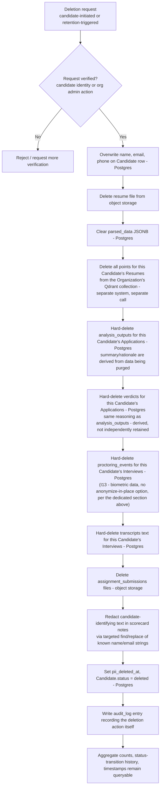

# 08 — Privacy and Compliance

**Purpose:** Define what personal data is collected, how it's protected and deleted, and which legal regimes must be considered before launch.

**Depends on:** [05-data-model.md](05-data-model.md) (what PII fields exist) and [06-architecture.md](06-architecture.md) (multi-tenancy/isolation mechanism this document relies on).
**Feeds into:** [09-roadmap.md](09-roadmap.md) (compliance readiness gates phase exit criteria).

> **Revision note (2026-07-15):** resume chunks/embeddings moved from a Postgres table to a dedicated Qdrant vector store (one collection per Organization). This adds Qdrant Cloud as a new subprocessor and changes the deletion flow's mechanics — see below. [CHANGELOG.md](../CHANGELOG.md) has the full pivot record.

> **Revision note (2026-07-16) — read this one carefully.** Sift now processes **biometric data** (via interview live proctoring's face/gaze/voice analysis) for the first time. This is the single biggest compliance-risk increase in this project's history: it moves Sift from "handles PII" to "handles a legally special category of PII" in most relevant jurisdictions (GDPR Art. 9, Illinois BIPA, and similar state biometric-privacy statutes elsewhere in the US), and interview recording/analysis itself independently triggers all-party/two-party recording-consent laws that vary by US state and by country. **This document's existing [NEEDS LEGAL REVIEW] items were already blocking; this revision adds items that are more consequential than anything currently on that list, and this feature should not process a single real candidate's data in any jurisdiction until they clear.** See the new "Interview proctoring — biometric data" section below.

> **This document is not legal advice.** It records product/engineering decisions and flags where formal legal review is required before launch. Items marked **[NEEDS LEGAL REVIEW]** must be signed off by qualified counsel before this system processes real candidate data in the relevant jurisdiction.

---

## What PII is collected

| Data | Source | Where stored | Notes |
|---|---|---|---|
| Full name, email, phone | Candidate submission | `candidates` table (PostgreSQL) | Primary identity fields; email is the dedup key per A8 in [02-assumptions.md](02-assumptions.md). |
| Resume file (may contain address, photo, nationality, age indicators depending on candidate's own content) | Candidate upload | Object storage, org-namespaced key | Sift does not request these fields; whatever the candidate includes in their own document is stored as-is. |
| Parsed work history, education, skills | Derived from resume via parsing worker | `resumes.parsed_data` (JSONB) | Derived PII — same sensitivity as source resume. |
| Interview scorecard notes (may reference candidate by name, may contain subjective assessment) | Interviewer input | `scorecards` table | Sensitive — this is evaluative data about a person, arguably higher-stakes than the resume itself. |
| Resume text chunks + vector embeddings | Derived from parsed resume via the embedding pipeline | Qdrant vector store (Qdrant Cloud), one collection per Organization — **no longer in Postgres** as of the 2026-07-15 revision | Same sensitivity as the source resume — `chunk_text` is a verbatim excerpt, and the embedding vector is a compressed representation that is not human-readable but is not legally "anonymous" (it can be used for similarity matching back to identifying content). This data now lives in a separate infrastructure boundary from the rest of Sift's PII, which is itself a new compliance-relevant fact — see [06-architecture.md](06-architecture.md). |
| LLM crew output (summaries, match rationale) | Generated by the LLM crew from resume + submitted scorecard content | `analysis_outputs` table | Derived evaluative data about a candidate — same sensitivity class as scorecard notes, since it's synthesized from them. |
| HR user name, email | Org invitation/signup | `hr_users` table | Employee (not candidate) PII — lower sensitivity but still in scope for org-level data-subject rights. |
| Interview transcript text | Video platform (provided) or Sift-generated via STT | `transcripts` table | May contain anything said in the interview, including candidate-volunteered sensitive info (health, family status, etc.) unrelated to the role — same "we don't solicit it, but candidates may say it" posture as resume content. |
| Proctoring integrity signals (event type, timestamp, confidence, vendor metadata) | Derived from live interview audio/video via a third-party detection vendor | `proctoring_events` table | **Biometric-adjacent data — see the dedicated section below.** Sift does not store the raw video/audio itself (see [03-ontology.md](03-ontology.md)'s "not first-class" note on ProctoringRecording), but the *derived* signals (e.g., "second face detected," "voice mismatch") are themselves sensitive: they're computed from a person's face/voice, and a false positive is an accusation with real consequences for the candidate. |
| Assignment submission content (file, text, or repo link) | Candidate upload | Object storage + `assignment_submissions` table | May contain the candidate's original work product; treated as candidate-authored content, same sensitivity class as a resume. |
| Verdict narratives and deterministic sub-scores | Generated by the Scoring Engine + Verdict/Judge agent from resume/scorecard/transcript/proctoring data | `verdicts` table | Derived evaluative data about a candidate, same sensitivity class as `analysis_outputs` — but higher-stakes, since a verdict's whole purpose is to say `pass`/`review`/`fail`. |

**Explicitly not collected in v1:** raw interview video/audio recordings (Sift references the video platform's own recording, it does not copy or store the bytes — see [03-ontology.md](03-ontology.md)), government ID numbers, explicit demographic/EEO data collection forms (candidates may voluntarily include such info in a resume, which Sift does not parse into structured fields or use in any scoring). **[Revised 2026-07-16]** Video/audio *analysis* (biometric signal extraction) is no longer excluded — see below; this line previously excluded it entirely, and that exclusion is being reversed deliberately, not silently.

### Third-party subprocessors introduced by the AI pipeline

Resume, scorecard, transcript, and proctoring-derived content now leave Sift's infrastructure boundary to reach several hosted providers, per [06-architecture.md](06-architecture.md) and [07-technical-stack.md](07-technical-stack.md):

| Provider | What it receives | Purpose |
|---|---|---|
| OpenRouter **[Changed 2026-07-16 — was Anthropic direct]** | Resume text, scorecard text, transcript text, proctoring event summaries, search/verdict context — everything every crew agent role (including the new Verdict/Judge) processes | Unified gateway routing to whichever underlying model serves each crew role, including Anthropic's models and the new Verdict model |
| Voyage AI | Resume chunk text, search query text | Generates embeddings for the RAG vector index |
| Qdrant Cloud | Resume chunk text + embeddings, at rest, for every Organization | Hosts the vector store the RAG search feature queries against |
| Video platform (Zoom/Meet/Teams — exact platform TBD) **[New 2026-07-16]** | Meeting metadata, and — for the meetings proctoring/transcription is enabled on — the recording/signal feed itself | Source of the audio/video signal proctoring and transcription ingest from; the org's own existing tool, but functions as a Sift subprocessor for the specific meetings proctoring is enabled on, since Sift's own bot/webhook integration is what receives the data |
| Proctoring signal detection vendor (TBD) **[New 2026-07-16]** | Interview audio/video (or a feed of it) for face/gaze/voice detection | Generates the biometric-adjacent signals written to `proctoring_events` — **this is the subprocessor receiving the most sensitive data class in this entire document** |
| Speech-to-text vendor (TBD, fallback only) **[New 2026-07-16]** | Interview audio, for meetings where the video platform doesn't provide its own transcript | Generates `transcripts.text` |

All of the above are data **subprocessors** of Sift with respect to each Organization's candidate data. **[NEEDS LEGAL REVIEW — a Data Processing Agreement (or equivalent subprocessor terms) must be in place with every provider above, and each Organization's own DPA with Sift must disclose all of them, before the relevant pipeline processes real candidate data in a regulated jurisdiction.]** The three new 2026-07-16 additions are **not a lighter-touch review than OpenRouter/Voyage/Qdrant** — the proctoring signal vendor in particular should be treated as the single highest-priority DPA to close, given it's the sole recipient of raw biometric signal outside Sift's own boundary. Do not treat "we haven't picked the vendor yet" as a reason to defer this review — vendor selection criteria should include DPA/compliance posture as a hard filter, not something evaluated after a vendor is already chosen on technical merit.

## Retention policy

| State | Retention | Rationale |
|---|---|---|
| Active Application (any non-terminal status) | Retained indefinitely while active | Needed for the pipeline visibility this system exists to provide. |
| Terminal Application (`hired`, `rejected`, `withdrawn`) | Retained 24 months post-terminal-status by default **[NEEDS LEGAL REVIEW — retention periods vary significantly by jurisdiction and by whether the org needs adverse-action defense records]** | Balances typical employment-claim statute-of-limitations windows against minimizing stored PII. Configurable per organization once legal review sets safe bounds. |
| Candidate record with no Application (shouldn't normally occur, but covers edge cases) | 90 days | No legitimate business purpose to retain longer without an associated pipeline. |
| Audit log entries | Retained for the life of the referenced entity plus the same retention window — never deleted independently of the entity it audits | The audit trail (enforcing **I4**) is meaningless if it can be deleted while the scorecard it documents still exists. |
| **Proctoring events (`proctoring_events`) [New 2026-07-16]** | **A materially shorter window than the general 24-month figure above — exact number [NEEDS LEGAL REVIEW], but biometric-privacy statutes (e.g., Illinois BIPA) typically require destruction "as soon as the purpose for collection has been satisfied," on the order of months, not years** | Biometric data carries a heavier minimization obligation than general PII in most relevant statutes; retaining it on the same schedule as ordinary pipeline data would very likely fail a legal review even before any candidate-specific request is made. This is **I13** in [04-invariants.md](04-invariants.md). |

Retention is enforced by a scheduled job that flags eligible Candidate/Application records for the deletion routine below — not immediate hard deletion at the retention boundary, to allow for an organization-configurable grace period. **The proctoring-events row above is the one exception where a longer grace period should not be assumed** — see the dedicated section immediately below.

## Interview proctoring — biometric data **[New 2026-07-16]**

This section exists because interview live proctoring is not simply "one more data type to add to the tables above" — it changes what *kind* of compliance obligation Sift has. Everything else in this document concerns ordinary personal data; this concerns **biometric data**, which most relevant legal regimes treat as a separate, heavier-obligation category.

**What triggers this classification:** face detection/matching and voice analysis, as used by the proctoring signal vendor (see [07-technical-stack.md](07-technical-stack.md)), operate on unique physical/behavioral characteristics of a person — the legal definition of biometric identifiers in the regimes below does not require Sift to *store* a face template or voiceprint for the classification to apply; *processing* audio/video to derive identity- or presence-related signals from a face or voice is generally sufficient to trigger it.

**Why this is treated as more consequential than every other item in this document:**

| Concern | Detail |
|---|---|
| **GDPR Art. 9 special category data** | Biometric data used "for the purpose of uniquely identifying a natural person" is a special category under GDPR, requiring a stronger lawful basis than ordinary consent under Art. 6 — explicit consent under Art. 9(2)(a), or another narrow exception. **[NEEDS LEGAL REVIEW]** whether proctoring's face-detection use case falls within this special category as implemented (it plausibly does, even if the system doesn't retain a persistent biometric template), and if so, whether the consent flow below meets the "explicit" bar Art. 9 requires (higher than Art. 6's ordinary consent). |
| **Illinois BIPA (and similar US state biometric statutes — Texas CUBI, Washington's biometric law, and a growing list of others)** | BIPA requires, before collection: a written policy, informed written consent, and a specific retention/destruction schedule — and creates a **private right of action** (individuals can sue directly, not only via regulator action), which materially raises the liability profile versus most of the other regimes in this document. **[NEEDS LEGAL REVIEW]** whether any target pilot organization has candidates or interviewers in Illinois (or another biometric-statute state) — if so, this is a launch blocker for that organization specifically until the written-policy/consent/retention requirements are concretely implemented, not just documented here. |
| **All-party / two-party recording consent laws** | Independent of the biometric-data question, *recording* a conversation at all requires all-party consent in a number of US states (e.g., California, Illinois, several others) and in various non-US jurisdictions — this applies to interview recording generally, not just the proctoring analysis step, and is why the consent flow below requires both the candidate's and the interviewer's affirmative consent, not the candidate's alone. **[NEEDS LEGAL REVIEW]** per state/country of both parties, not just the organization's home jurisdiction — a candidate or interviewer physically located in a two-party-consent jurisdiction triggers this regardless of where the hiring organization is based. |
| **Disparate impact / fairness** | Face/voice detection systems have well-documented accuracy disparities across demographic groups in the broader industry. A false "multiple faces detected" or "voice mismatch" flag is not a neutral data-quality issue here — it's a potential source of discriminatory outcomes if HR users weight proctoring verdicts in a hiring decision. **[NEEDS LEGAL REVIEW / product decision]** whether proctoring verdicts require a stronger "advisory only, must be corroborated before any adverse action" framing than the other two verdict services, and whether the chosen detection vendor's own bias-audit documentation (see [07-technical-stack.md](07-technical-stack.md)) is sufficient to rely on. |

**Product/engineering mitigations already designed in** (not a substitute for the legal review above, but real design decisions that reduce exposure):

- **Org-by-org, jurisdiction-gated enablement**, not a platform-wide default — per [01-problem-space-and-scope.md](01-problem-space-and-scope.md), proctoring is opt-in per organization and should not be enabled for a jurisdiction until legal review clears it.
- **Two-party consent captured explicitly**, before signal ingestion begins — enforced at the data layer by `proctoring_sessions.candidate_consented_at`/`interviewer_consented_at` both being required before any `proctoring_events` row can be written (see [05-data-model.md](05-data-model.md)).
- **No raw biometric data retained** — Sift stores only derived event signals, never the source video/audio bytes (see [03-ontology.md](03-ontology.md)'s ProctoringRecording note), which narrows (but does not eliminate) the biometric-data footprint.
- **Shorter, dedicated retention window** for `proctoring_events` (I13, retention table above).
- **No real-time intervention** (I15) — a flag is never acted on without a human reviewing it first, which is the primary mitigation against the disparate-impact concern above, though not a complete one (a human reviewer can still be unduly influenced by a wrong flag).

**What is explicitly not yet resolved and blocks launch of this specific feature:** the written biometric policy BIPA requires, the exact retention window, the specific consent language for both parties (distinct from and in addition to the existing resume-submission consent below), and confirmation of which pilot organizations/jurisdictions this feature can legally launch in first. None of this is a "nice to have before scaling" — per [00-ideation.md](00-ideation.md)'s success criteria, legal sign-off for a jurisdiction is now an explicit precondition for enabling proctoring there at all, not a trailing concern.

## Deletion / right-to-be-forgotten handling

Implements invariant **I9** from [04-invariants.md](04-invariants.md): deletion **anonymizes** PII fields rather than removing rows, preserving referential integrity and aggregate analytics.

Note on the Qdrant delete step and `analysis_outputs`: unlike the Candidate row itself (anonymized in place per **I9**), these are **hard-deleted**, not anonymized, because they exist only to serve search/retrieval and summarization — there is no aggregate-analytics reason to retain a deleted candidate's embeddings or LLM-generated summary the way there is for pipeline funnel counts. This also removes them from the vector index immediately, so a deleted candidate can never surface in a future RAG search result.

**[New 2026-07-16]** The same hard-delete-not-anonymize reasoning extends to `verdicts`, `proctoring_events`, `transcripts.text`, and `assignment_submissions` files — all are derived/candidate-authored content with no independent aggregate-analytics value once the candidate is deleted. `proctoring_events` is the most urgent of these to get right: because I13 already requires purging this data on a short, hard timeline regardless of any deletion request, the I9 deletion routine's proctoring-events step is really just "run the I13 purge immediately instead of waiting for the retention window," not a new mechanism — the two invariants share one implementation.

**[Revised 2026-07-15] New risk: this routine now spans two systems, not one transaction.** Previously, `resume_chunks` was a Postgres table and the entire deletion routine (Candidate anonymization + chunk deletion + analysis_outputs deletion) could run inside a single database transaction — it either all committed or all rolled back. With chunk data now in Qdrant, the Postgres writes and the Qdrant point-deletion call are two separate operations with no shared transaction. If the Qdrant call fails after the Postgres transaction commits (or the reverse ordering is used and Postgres fails after Qdrant succeeds), the system is left in a partially-deleted state: either PII is anonymized in Postgres but the candidate's chunks are still searchable in Qdrant (a live I9/I11 violation until reconciled), or vice versa. This needs an explicit compensating-action design — a retry queue with alerting on repeated failure, or a reconciliation job that periodically diffs "candidates marked deleted in Postgres" against "points still present in Qdrant" — before this routine is treated as complete. Flagged as an open question below, not yet resolved.

Note on scorecard redaction: this is a best-effort targeted redaction (known name/email strings), not a guarantee that free-text notes contain zero indirect identifying information — interviewers should be trained not to write identifying details unnecessary to the evaluation itself. **[NEEDS LEGAL REVIEW — whether best-effort redaction of free-text fields meets the deletion standard required in target jurisdictions, or whether full note deletion is required upon request even at the cost of losing evaluative history.]**

### Deletion propagation to third-party subprocessors

Deleting `resume_chunks` and `analysis_outputs` from Sift's own database does not, by itself, guarantee data sent to Anthropic or Voyage AI during processing is purged from those providers' systems. **[NEEDS LEGAL REVIEW — confirm each provider's data retention terms for API inputs (e.g., whether prompts/inputs are retained for abuse monitoring, and for how long), and whether Sift's deletion routine needs an explicit provider-side deletion call or is covered by the providers' standard retention/deletion terms under their DPA.]**

## Consent flow for candidates

Resume submission requires an explicit, unchecked-by-default checkbox at the point of upload:

> "I consent to [Organization Name] storing and processing my resume and application data — including analysis by AI/language-model providers to extract resume details, generate summaries, and support recruiter search — to evaluate me for this and related roles, as described in [Organization]'s privacy notice."

This consent is **scoped to the specific Organization**, not to Sift as a platform — consistent with the org-scoped Candidate identity decision in [03-ontology.md](03-ontology.md). A candidate applying to two different organizations on Sift consents twice, independently, and neither organization's consent implies anything about the other.

What consent explicitly does **not** imply: consent to autonomous ranking/scoring decisions that gate a pipeline stage without human review (the verdict services introduced in [00-ideation.md](00-ideation.md) are all advisory-only, per its non-goals — a `fail` verdict is a flag for a human, never an automatic rejection), or consent to indefinite retention beyond the stated policy above. **[Revised 2026-07-16]** This resume-submission consent also does **not** cover interview proctoring — that requires its own separate consent flow below, from both the candidate and the interviewer, precisely because it's triggered by a different action (a scheduled interview, not a resume submission) and carries the heavier biometric-data obligations described above.

**[NEEDS LEGAL REVIEW — exact consent language, whether a privacy notice link is sufficient or full text must be inline, and whether consent needs to be re-obtained if retention policy changes.]**

### Consent flow for interview proctoring **[New 2026-07-16]**

Separate from, and in addition to, the resume-submission consent above. Both the candidate and the interviewer must explicitly consent before any proctoring signal ingestion begins for a given interview — this is enforced at the data layer, not just presented as a UI step: `proctoring_sessions.candidate_consented_at` and `interviewer_consented_at` must both be set before any `proctoring_events` row can be written (see [05-data-model.md](05-data-model.md), I13/A22).

Draft candidate-facing language (subject to the same legal review as the resume-submission text, and likely needing to be *stronger* given the Art. 9/BIPA considerations above, not merely reused):

> "This interview will be monitored for integrity signals (e.g., detecting if someone else is present, or if audio/video appears altered) using automated analysis of the video/audio, including analysis of your face and voice. This analysis is derived from, but does not store, a copy of the recording itself. Results are reviewed by [Organization Name]'s hiring team as one input among others — they do not automatically reject or advance your application. You may decline; declining will [NEEDS PRODUCT/LEGAL DECISION — does declining block the interview from proceeding on this platform, or does it proceed unmonitored]."

Interviewer-facing consent covers the same recording/analysis disclosure from the other party's side, since all-party consent laws apply symmetrically to both participants in the conversation, not just the candidate.

**[NEEDS LEGAL REVIEW — this entire flow, with priority: (1) exact language sufficient to meet GDPR Art. 9 "explicit consent" and BIPA's "informed written consent" bars, which are both stricter than the ordinary consent standard the resume-submission flow was written to meet; (2) what happens if a candidate or interviewer declines — this is a genuine open product question, not just a legal one, flagged below; (3) whether a single consent action covers all interviews for that Application, or must be captured per-interview.]**

## Cross-org data isolation

Full technical detail lives in [06-architecture.md](06-architecture.md) (Postgres RLS + Qdrant collection-per-organization + application-layer scoping + namespaced object storage). From a compliance standpoint, the relevant guarantee is: **Organization A can never query, export, or view Organization B's candidate data through any product surface**, including admin/support tooling — support access must be scoped per-incident to a specific organization, not globally privileged by default. This directly implements invariant **I2**, and now spans both storage systems described above rather than Postgres alone.

## Relevant regimes to consider

| Regime | Applies when | Key consideration for Sift | Status |
|---|---|---|---|
| GDPR (EU/UK) | Any candidate or HR user located in EU/UK, regardless of where the org is headquartered | Right to erasure (implemented above), right to access/export, lawful basis for processing (consent, as above); **[Revised 2026-07-16]** interview proctoring's face/voice analysis likely triggers **Art. 9 special category data**, requiring explicit consent (a stricter bar than the ordinary Art. 6 consent the rest of this document was written against), plus a potential Data Protection Impact Assessment (DPIA) requirement given the automated-processing/profiling characteristics of proctoring | **[NEEDS LEGAL REVIEW]** |
| India DPDP Act 2023 | Candidates or orgs operating in India | Consent notice requirements, data fiduciary obligations, cross-border transfer restrictions if hosting is outside India | **[NEEDS LEGAL REVIEW]** |
| US state laws (CCPA/CPRA and similar) | California (and increasingly other states) resident candidates | Right to know/delete, "sale of data" definitions (Sift does not sell data, but this must be explicitly stated in the privacy notice); California also independently requires all-party consent to record conversations (Penal Code §632), relevant to proctoring | **[NEEDS LEGAL REVIEW]** |
| **US biometric privacy statutes (Illinois BIPA, Texas CUBI, Washington, and others) [New 2026-07-16]** | Any candidate or interviewer located in a state with a biometric privacy statute, regardless of org headquarters | Written policy, informed written consent, and a defined retention/destruction schedule before biometric processing begins; **BIPA specifically creates a private right of action**, a materially higher liability profile than most other regimes in this table | **[NEEDS LEGAL REVIEW — highest priority in this table, given the private-right-of-action exposure; see the dedicated "Interview proctoring — biometric data" section above]** |
| **All-party/two-party recording consent laws (multiple US states and non-US jurisdictions) [New 2026-07-16]** | Any candidate or interviewer physically located in a two-party-consent jurisdiction | Applies to interview *recording* generally, independent of the biometric-data question — both parties must consent to the call being recorded/analyzed at all | **[NEEDS LEGAL REVIEW — determines whether the two-party consent flow above is legally sufficient per-jurisdiction, or whether some jurisdictions require additional formality (e.g., written, not just clicked)]** |
| EEOC / adverse-action recordkeeping (US) | US-based hiring orgs | May create tension with the retention-minimization approach above — some US employment law contexts expect records retained *specifically to defend against* discrimination claims, which argues for longer, not shorter, retention in certain fields; **[Revised 2026-07-16]** this tension is sharper for proctoring specifically, since I13's biometric-data retention window pushes toward *shorter* retention right as a disparate-impact claim might most need the underlying signal data preserved as evidence | **[NEEDS LEGAL REVIEW — potential conflict between deletion-on-request and adverse-action recordkeeping obligations needs explicit resolution, likely via retaining anonymized aggregate data only, as designed above; the proctoring-specific version of this tension needs its own resolution, not an assumed extension of the existing answer]** |

## Open Questions

- **New in this revision:** what is the compensating action when the two-system deletion routine (Postgres anonymization + Qdrant point deletion) partially fails — see the risk called out above. This should be resolved before the deletion routine is built, not discovered in production.
- **New in this revision:** does adding Qdrant Cloud as a third AI-adjacent subprocessor change any jurisdiction's cross-border transfer analysis (e.g., where does Qdrant Cloud host data relative to Anthropic/Voyage) — this needs the same legal review already pending for the original two providers, not a lighter-touch pass just because it's "only" a vector database rather than an LLM.
- Is Sift the data **processor** (acting on behalf of each Organization/controller) in all jurisdictions, or does any product surface (e.g., cross-org aggregate benchmarking, if ever built) make Sift a controller for some data — this materially changes DPA obligations.
- What is the actual default retention period once legal review completes — the 24-month figure above is a placeholder based on general employment-claim norms, not a jurisdiction-specific analysis.
- Does v1 need a self-service data export ("right to access") feature for candidates, or is a manual/support-mediated process acceptable pre-launch given expected volume?
- Does any target jurisdiction (per the regimes table below) restrict sending candidate PII to AI model providers whose infrastructure may process data outside the candidate's home region — i.e., does the RAG/crew pipeline introduce a cross-border transfer question that the original architecture didn't have?
- **New 2026-07-16, highest priority:** which pilot organizations/jurisdictions can interview proctoring actually launch in first, given the BIPA private-right-of-action exposure and the Art. 9/DPIA question above — this should be answered before any engineering work on E21 (Interview Live Proctoring) begins in earnest, not treated as a parallel-track legal review that engineering doesn't wait for.
- **New 2026-07-16:** what happens if a candidate or interviewer declines proctoring consent — does the interview proceed unmonitored, get rescheduled onto a non-monitored process, or is proctoring mandatory for interviews at organizations that enable it (in which case declining may need to be framed as declining the interview itself, which raises its own fairness questions)? Flagged as unresolved in the consent flow section above.
- **New 2026-07-16:** does the chosen proctoring signal detection vendor's own terms permit Sift's stated deletion/retention commitments (I13) — i.e., does the vendor itself retain a copy of submitted audio/video on its own infrastructure, and if so, does *their* retention policy need to match Sift's, or does Sift's deletion routine need to explicitly call the vendor's own deletion API?
- **New 2026-07-16:** should verdict narratives (all three services, not just proctoring) be treated as part of the candidate's data subject access request (DSAR) response by default, given they're evaluative content about the candidate generated by Sift — or does the same logic that keeps raw scorecard notes DSAR-sensitive-but-includable apply here without a separate decision?
