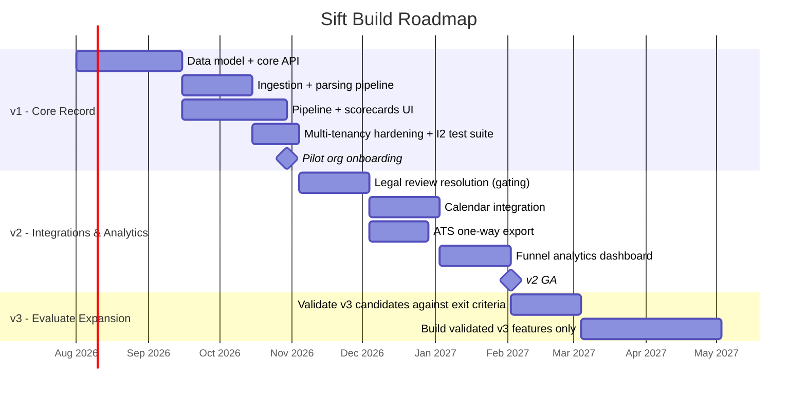

# 09 — Roadmap

**Purpose:** Phase the build so scope commitments are explicit and sequenced, mapped directly to the in-scope/out-of-scope decisions already made.

**Depends on:** [01-problem-space-and-scope.md](01-problem-space-and-scope.md) (phases are this doc's scope table, sequenced) and [08-privacy-and-compliance.md](08-privacy-and-compliance.md) (compliance sign-off gates phase exits).
**Feeds into:** Nothing downstream — this is the terminal document; it is the one most expected to be revised as reality intervenes.

---

## Phase overview

| Phase | Theme | Ships | Does NOT ship |
|---|---|---|---|
| v1 | Prove the core record: intake → pipeline → structured feedback | Resume intake (web + email-in), parsing, fixed application pipeline, interview scheduling metadata, structured scorecards, on-demand candidate summary, single-org-scoped auth, consent + deletion flow | Any item from the Scope Creep Watchlist in [01-problem-space-and-scope.md](01-problem-space-and-scope.md); calendar-native scheduling; ATS integration; candidate self-service portal |
| v2 | Reduce integration friction, add pipeline analytics | One-way ATS export, calendar integration (read availability, write scheduled events), requisition-level funnel analytics dashboard, configurable scorecard competency templates per requisition (already in data model, exposed in UI), stage *renaming* (not restructuring) | Bi-directional ATS sync, AI ranking, video/audio capture, custom pipeline stages beyond renaming |
| v3 | Evaluate expansion based on validated demand | Candidate self-service portal (if repeat-application volume justifies it, per Open Question in [00-ideation.md](00-ideation.md)); opt-in advisory analytics (e.g., flagging incomplete scorecards, pipeline bottlenecks) — explicitly **not** candidate ranking; deeper multi-language parsing support if A5's English/PDF assumption proves too narrow | Full ATS replacement, offer/e-signature management, native sourcing — none of these are planned even in v3 without a separate scoping exercise, since they represent fundamentally different products |

## Exit criteria per phase

**v1 → v2** requires all of:
- Success criteria from [00-ideation.md](00-ideation.md) trending toward target with at least one pilot organization (≥90% resumes without manual re-keying, ≥80% decisions with complete scorecards).
- Zero cross-tenant data isolation incidents (I2 test suite green on every deploy, no exceptions found in pilot usage).
- The three highest-confidence Open Unknowns from [02-assumptions.md](02-assumptions.md) validated with real pilot data (pipeline shape fit, resume format distribution, scorecard competency field adequacy).
- **[NEEDS LEGAL REVIEW]** items in [08-privacy-and-compliance.md](08-privacy-and-compliance.md) resolved for at least the jurisdiction(s) the pilot organizations operate in.

**v2 → v3** requires all of:
- At least one organization actively using ATS export and calendar integration without support-escalation-level friction.
- Funnel analytics adopted (viewed regularly, not just available) by pilot organizations, establishing that deeper analytics investment in v3 has a real audience.
- A specific, named organization request substantiates each v3 feature before it's built — per the Scope Creep Watchlist's "what would need to be true" conditions, not built speculatively.

## Timeline

## Open Questions

- Should v1's pilot phase be time-boxed (e.g., fixed 8 weeks) or milestone-boxed (proceeds to v2 only when exit criteria are met, regardless of elapsed time) — the exit-criteria framing above implies the latter, confirm this is the intended operating model.
- Which specific organization(s) will serve as v1 design partners, and does their profile match the target org-size assumptions (A14) closely enough to validate them meaningfully?
- If a v2/v3 exit criterion is never met (e.g., no organization ever requests a specific v3 feature), is the plan to simply not build it indefinitely, or is there a re-evaluation trigger (e.g., annual scope review)?
