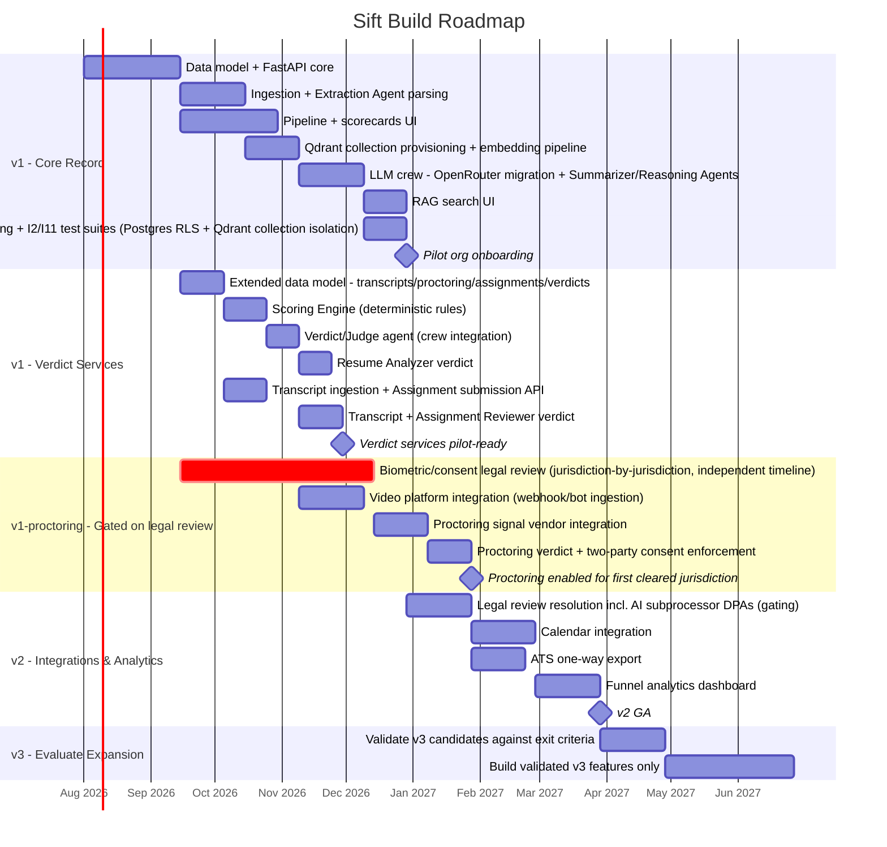

# 09 — Roadmap

**Purpose:** Phase the build so scope commitments are explicit and sequenced, mapped directly to the in-scope/out-of-scope decisions already made.

**Depends on:** [01-problem-space-and-scope.md](01-problem-space-and-scope.md) (phases are this doc's scope table, sequenced) and [08-privacy-and-compliance.md](08-privacy-and-compliance.md) (compliance sign-off gates phase exits).
**Feeds into:** Nothing downstream — this is the terminal document; it is the one most expected to be revised as reality intervenes.

---

## Phase overview

| Phase | Theme | Ships | Does NOT ship |
|---|---|---|---|
| v1 | Prove the core record: intake → pipeline → structured feedback, plus RAG-based search and the three scored-assessment verdict services over it | Resume intake (web + email-in), parsing via the LLM crew's Extraction Agent, fixed application pipeline, interview scheduling metadata, structured scorecards, on-demand candidate summary (Summarizer Agent), HR-initiated RAG search & match rationale, single-org-scoped auth, consent + deletion flow covering embeddings, **Scoring Engine + Verdict/Judge agent (all crew model access via OpenRouter), Resume Analyzer verdict, Interview Transcript + Assignment Reviewer verdict** | Any item from the Scope Creep Watchlist in [01-problem-space-and-scope.md](01-problem-space-and-scope.md), including autonomous/background candidate ranking; calendar-native scheduling; ATS integration; candidate self-service portal |
| **v1-proctoring (gated)** **[New 2026-07-16]** | Interview Live Proctoring specifically — sequenced separately from the rest of v1, not bundled into its exit criteria | Video platform signal ingestion, biometric integrity detection, proctoring verdict — **enabled only per-organization, per-jurisdiction, after that jurisdiction's biometric/consent legal review clears (see [08-privacy-and-compliance.md](08-privacy-and-compliance.md))** | Enabling proctoring for any organization/jurisdiction ahead of its own legal sign-off, regardless of whether the engineering work is done |
| v2 | Reduce integration friction, add pipeline analytics | One-way ATS export, calendar integration (read availability, write scheduled events), requisition-level funnel analytics dashboard, configurable scorecard competency templates per requisition (already in data model, exposed in UI), stage *renaming* (not restructuring) | Bi-directional ATS sync, AI ranking, custom pipeline stages beyond renaming |
| v3 | Evaluate expansion based on validated demand | Candidate self-service portal (if repeat-application volume justifies it, per Open Question in [00-ideation.md](00-ideation.md)); opt-in advisory analytics (e.g., flagging incomplete scorecards, pipeline bottlenecks) — explicitly **not** candidate ranking; deeper multi-language parsing support if A5's English/PDF assumption proves too narrow | Full ATS replacement, offer/e-signature management, native sourcing — none of these are planned even in v3 without a separate scoping exercise, since they represent fundamentally different products |

**Why proctoring is a separate row, not just a v1 line item:** every other v1 capability's timeline risk is technical (build it correctly, on schedule). Proctoring's timeline risk is legal and largely outside engineering's control (see the Illinois BIPA private-right-of-action exposure in [08-privacy-and-compliance.md](08-privacy-and-compliance.md)) — coupling its ship date to the rest of v1's exit criteria would either delay the entire v1 pilot on a legal review with its own independent timeline, or create pressure to launch proctoring before that review is actually done. Decoupling it avoids both failure modes.

## Exit criteria per phase

**v1 → v2** requires all of:
- Success criteria from [00-ideation.md](00-ideation.md) trending toward target with at least one pilot organization (≥90% resumes without manual re-keying, ≥80% decisions with complete scorecards, ≥50% of RAG searches acted on).
- Zero cross-tenant data isolation incidents (I2 **and I11** test suites green on every deploy, no exceptions found in pilot usage — the Qdrant collection-per-organization cross-tenant test is treated with the same release-blocker severity as the Postgres RLS test, per [04-invariants.md](04-invariants.md)'s 2026-07-15 revision).
- The three highest-confidence Open Unknowns from [02-assumptions.md](02-assumptions.md) validated with real pilot data (pipeline shape fit, resume format distribution, scorecard competency field adequacy), plus the embedding-quality unknown (A16) validated against real search usage.
- **[NEEDS LEGAL REVIEW]** items in [08-privacy-and-compliance.md](08-privacy-and-compliance.md) resolved for at least the jurisdiction(s) the pilot organizations operate in, including the third-party AI subprocessor DPAs.
- **New 2026-07-16:** Resume Analyzer and Transcript/Assignment Reviewer verdicts trending toward useful (per the HR-agreement metric in [00-ideation.md](00-ideation.md)), and **I12** (no Judge without a Scoring Engine result) verified in the same release-blocker test class as I2/I11.
- **Explicitly NOT required for v1→v2:** interview proctoring does not need to be live anywhere for v1 to exit — see the gated row above. A pilot organization can complete v1 successfully with proctoring never enabled.

**v1-proctoring → enabled for a given organization** requires, per-organization/per-jurisdiction:
- Legal sign-off specifically on the biometric-data and all-party-recording-consent items in [08-privacy-and-compliance.md](08-privacy-and-compliance.md) for every jurisdiction that organization's candidates/interviewers may be located in.
- The two-party consent flow implemented and enforced at the data layer (`proctoring_sessions` consent fields, I13/A22) — not a checkbox with no backing enforcement.
- **I15** (no real-time intervention) verified via the same architectural code-review check described in [04-invariants.md](04-invariants.md).
- A named proctoring signal detection vendor under a signed DPA (see the open question in [07-technical-stack.md](07-technical-stack.md) and [08-privacy-and-compliance.md](08-privacy-and-compliance.md)).

**v2 → v3** requires all of:
- At least one organization actively using ATS export and calendar integration without support-escalation-level friction.
- Funnel analytics adopted (viewed regularly, not just available) by pilot organizations, establishing that deeper analytics investment in v3 has a real audience.
- A specific, named organization request substantiates each v3 feature before it's built — per the Scope Creep Watchlist's "what would need to be true" conditions, not built speculatively.

## Timeline

Note the `crit` marking on the legal review task: it's the one bar on this chart whose duration is a placeholder, not an estimate — 90 days is a guess at "at least a full quarter," not a scoped legal timeline. Everything in the v1-proctoring section downstream of it is sequenced after it deliberately, so that a slow legal review delays only proctoring, never the rest of v1 (see the exit-criteria section above).

## Open Questions

- Should v1's pilot phase be time-boxed (e.g., fixed 8 weeks) or milestone-boxed (proceeds to v2 only when exit criteria are met, regardless of elapsed time) — the exit-criteria framing above implies the latter, confirm this is the intended operating model.
- Which specific organization(s) will serve as v1 design partners, and does their profile match the target org-size assumptions (A14) closely enough to validate them meaningfully?
- If a v2/v3 exit criterion is never met (e.g., no organization ever requests a specific v3 feature), is the plan to simply not build it indefinitely, or is there a re-evaluation trigger (e.g., annual scope review)?
- The v1 timeline now includes the embedding pipeline and multi-model LLM crew as sequential dependencies before pilot onboarding — should RAG search instead ship as a fast-follow shortly after a leaner v1 pilot (core record only), to de-risk the pilot timeline from AI-pipeline build risk?
- **New 2026-07-16:** is decoupling proctoring's ship date from the rest of v1 (the new "v1-proctoring, gated" row) the right call, or does the product need all three verdict services to launch together for a coherent pilot pitch, in which case the entire v1 pilot's timeline is hostage to the legal review's actual (unknown) duration? This is a real product-strategy tradeoff, not just a scheduling detail.
- **New 2026-07-16:** the 90-day legal-review placeholder in the Gantt chart is a guess, not an estimate grounded in an actual scoping conversation with counsel — should that conversation happen before this roadmap is treated as more than directional for the proctoring track specifically?
- **New 2026-07-16:** should the Resume Analyzer and Transcript/Assignment Reviewer verdicts require their own lighter-weight product/legal review (disparate-impact review of the Scoring Engine's rubrics, per the open question in [02-assumptions.md](02-assumptions.md)) before pilot launch, even though they don't trigger the biometric-data category proctoring does — currently bundled into the general v1→v2 exit criteria without a dedicated gate of their own.
