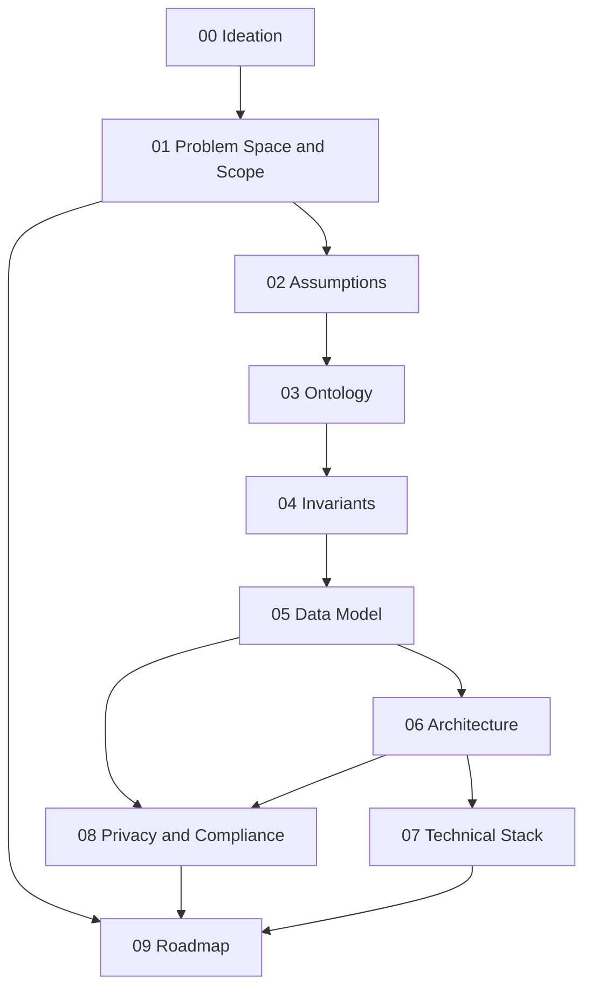

# Sift — Documentation Index

Resume Collector & Interview Analyzer platform for HR teams, now also offering three scored-assessment services — Resume Analyzer, Interview Live Proctoring, and Interview Transcript + Assignment Reviewer (see [00-ideation.md](00-ideation.md)'s 2026-07-16 revision note). This documentation set is meant to be read in order — each document depends on the decisions made in the ones before it, and later documents (data model, architecture) are direct translations of earlier ones (ontology, invariants), not independent designs.

**If you're only reading one thing before touching the proctoring service specifically:** read [08-privacy-and-compliance.md](08-privacy-and-compliance.md)'s "Interview proctoring — biometric data" section first. It carries more unresolved legal risk than the rest of this document set combined.

## Reading order

| # | Document | Summary |
|---|---|---|
| 00 | [Ideation](00-ideation.md) | Why this exists, who it's for, what success looks like six months post-launch, and the three scored-assessment services extending the core value proposition. |
| 01 | [Problem Space and Scope](01-problem-space-and-scope.md) | The precise problem statement, a hard in/out-of-scope table (now including the Scoring Engine and all three verdict services), and a watchlist of tempting features deliberately excluded — including the ones still excluded even after proctoring's inclusion, like real-time intervention. |
| 02 | [Assumptions](02-assumptions.md) | What must be true about users, resumes, interview data, and the new verdict services (video platform integration, consent, OpenRouter reliability) for this design to hold, each with a confidence level and what breaks if wrong. |
| 03 | [Ontology](03-ontology.md) | The core entities — Candidate, Resume, Application, Interview, Scorecard, and now Transcript, ProctoringSession/Event, Assignment/Submission, and Verdict — their identity and lifecycle, and what's deliberately not modeled (including raw proctoring recordings). |
| 04 | [Invariants](04-invariants.md) | System-level rules that must always hold, including the four new verdict-service invariants (I12–I15), the most consequential being I15: proctoring never intervenes in a live interview. |
| 05 | [Data Model](05-data-model.md) | The concrete schema — every relational entity as a Postgres table, the Qdrant vector store, and the six new tables (transcripts, proctoring_sessions, proctoring_events, assignments, assignment_submissions, verdicts) — mapped back to which invariants they enforce. |
| 06 | [Architecture](06-architecture.md) | Components (separate Python backend, RAG vector search, multi-model LLM crew — now four agents including the Verdict/Judge — all routed through OpenRouter), the Scoring Engine, proctoring/transcript ingestion flows, the sync/async boundary, and multi-tenancy isolation. |
| 07 | [Technical Stack](07-technical-stack.md) | Concrete technology choices per layer, including OpenRouter as the unified LLM gateway and several deliberately-still-open decisions (exact Verdict model, video platform, proctoring vendor) stated as open rather than guessed at. |
| 08 | [Privacy and Compliance](08-privacy-and-compliance.md) | What PII is collected, retention and deletion handling, consent flows (now two — resume submission, and the separate two-party proctoring consent), third-party subprocessors, and regimes flagged for legal review — **including the new biometric-data section, the highest-stakes content in this entire doc set.** |
| 09 | [Roadmap](09-roadmap.md) | The v1/v2/v3 phased build plan — with interview proctoring's ship date deliberately decoupled from the rest of v1's exit criteria, gated per-organization/per-jurisdiction on legal review. |

## Document dependency graph

## How to use this set

- Start at 00 and read forward the first time through — each document assumes the ones before it.
- If you're implementing a specific layer (e.g., the database), you can jump straight to [05-data-model.md](05-data-model.md), but check its "Depends on" note and skim [03-ontology.md](03-ontology.md) and [04-invariants.md](04-invariants.md) first — the schema is a direct translation of those, not a standalone design.
- Every document ends with an "Open Questions" section. These are not gaps in the writing — they are the specific unresolved decisions that should be revisited before or during the relevant build phase in [09-roadmap.md](09-roadmap.md).
